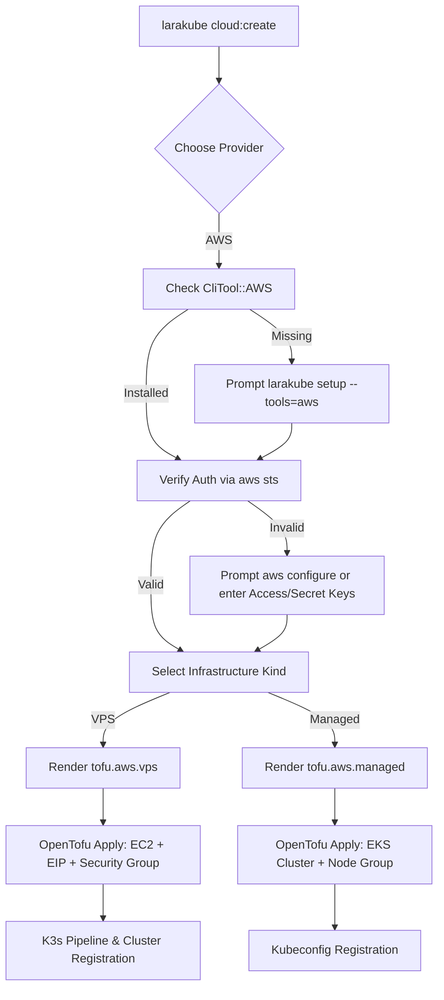

# Implementation Plan: Amazon Web Services (AWS) Provider Integration

**Status:** 📋 PROPOSED (Pending Review)  
**Target Commands:** `cloud:create`, `cloud:scale`, `setup`

---

## 🎯 Executive Summary & Context

LaraKube currently supports DigitalOcean (DO) and Google Cloud Platform (GCP). To enable developers and operators to deploy on AWS (e.g., leveraging AWS credits, Free Tier, or corporate accounts), we will introduce first-class AWS support for:
1. **VPS Infrastructure**: Single-node AWS EC2 VM with Elastic IP + persistent storage running root k3s, secured with an AWS Security Group.
2. **Managed Infrastructure**: Elastic Kubernetes Service (EKS) managed cluster and worker node groups.
3. **AWS CLI Integration (`CliTool::AWS`)**: Automated installation (`brew install awscli` on macOS, official bundle on Linux/WSL2) via `larakube setup --tools=aws` and automatic authentication detection (`aws sts get-caller-identity`).
4. **Interactive Credentials Flow**: Auto-detecting active AWS profiles/credentials, offering 1-click `aws configure` or direct Access Key & Secret Key entry, with non-interactive flag support.

---

## 📐 Architecture & Design Decisions

Based on our interactive alignment:
- **Infrastructure Scope**: Both VPS (EC2 + single-node k3s) and Managed (EKS), with VPS as the primary low-cost option for credits.
- **Authentication**: Auto-detect credentials via `aws sts get-caller-identity`. If unauthenticated, offer interactive `aws configure` / profile selection or prompt for Access Key ID & Secret Access Key.
- **CLI Tooling**: Add `CliTool::AWS` with Homebrew on macOS and official AWS CLI v2 bundle on Linux/WSL2; prompt to install during `cloud:create` if missing.
- **Regions & Sizing**:
  - Default Region: `us-east-1` (N. Virginia), with all major global regions supported.
  - Default VPS Machine Type: `t3.medium` (2 vCPU, 4 GB RAM, ~$30/mo), with options for `t3.micro` (Free Tier eligible), `t3.small`, `t3.large`, `t3.xlarge`.
  - Default Managed Node Size: `t3.medium`, with options for `t3.large`, `m5.large`, `m5.xlarge`.



---

## 📦 User Experience & Flow

### 1. Interactive Experience
```
LARAKUBE LaraKube Cloud Pilot: OpenTofu Provisioner

Which cloud provider?
❯ Amazon Web Services

What kind of infrastructure?
❯ VPS / droplet (SSH + k3s, single-node)

  ✓ Detected active authentication via local aws CLI (Account: 123456789012, arn:aws:iam::123456789012:user/admin).

AWS region
❯ us-east-1 — N. Virginia (Recommended)
  us-east-2 — Ohio
  us-west-2 — Oregon
  eu-west-1 — Ireland
  ap-southeast-1 — Singapore

Machine type
❯ t3.medium — 2 vCPU, 4 GB RAM (~$30/mo, Recommended)
  t3.micro — 2 vCPU, 1 GB RAM (Free Tier eligible)
  t3.small — 2 vCPU, 2 GB RAM (~$15/mo)
  t3.large — 2 vCPU, 8 GB RAM (~$60/mo)

SSH key
❯ id_ed25519 (~/.ssh/id_ed25519)

Admin CIDR (optional)
> [leave blank for open]

Provisioning AWS EC2 instance 'larakube-vps-test'...
  ✓ EC2 Instance ready at 54.210.12.34
  ✓ k3s installed and running
  ✓ Registered stack larakube-vps-test
```

---

## 🛠️ Proposed File Changes

### 1. `cli/app/Enums/CliTool.php` [MODIFY]
- Add `case AWS = 'aws';`
- Label: `'AWS CLI (Amazon Web Services)'`
- Binary: `'aws'`
- Candidate paths: `/usr/local/bin/aws`, `/opt/homebrew/bin/aws`, etc.
- Add `installAws()`:
  - macOS: `brew install awscli`
  - Linux/WSL2: downloads official AWS CLI v2 bundle (`awscli-exe-linux-x86_64.zip`), unzips, runs `./aws/install`.
- Add `ensureAwsAuth(bool $prompt = true)`:
  - Runs `aws sts get-caller-identity 2>/dev/null`
  - If unauthenticated, prompts to run `aws configure`.

### 2. `cli/app/Enums/CloudProvider.php` [MODIFY]
- Add AWS details to `regions()`:
  - `us-east-1` (N. Virginia), `us-east-2` (Ohio), `us-west-1` (N. California), `us-west-2` (Oregon), `eu-west-1` (Ireland), `eu-central-1` (Frankfurt), `ap-southeast-1` (Singapore), `ap-southeast-2` (Sydney), `ap-northeast-1` (Tokyo).
- Set `defaultRegion()` for AWS to `us-east-1`.
- Add AWS details to `vpsSizes()`:
  - `t3.micro` (2 vCPU, 1 GB RAM, Free Tier eligible)
  - `t3.small` (2 vCPU, 2 GB RAM, ~$15/mo)
  - `t3.medium` (2 vCPU, 4 GB RAM, ~$30/mo, Recommended)
  - `t3.large` (2 vCPU, 8 GB RAM, ~$60/mo)
  - `t3.xlarge` (4 vCPU, 16 GB RAM, ~$120/mo)
- Set `defaultVpsSize()` for AWS to `t3.medium`.
- Add AWS details to `managedSizes()`:
  - `t3.medium` (2 vCPU, 4 GB RAM, ~$30/mo per node)
  - `t3.large` (2 vCPU, 8 GB RAM, ~$60/mo per node)
  - `m5.large` (2 vCPU, 8 GB RAM, ~$70/mo per node)
  - `m5.xlarge` (4 vCPU, 16 GB RAM, ~$140/mo per node)
- Set `defaultManagedSize()` for AWS to `t3.medium`.
- Add `self::AWS->value => self::AWS->label()` to `activeProviders()`.

### 3. `cli/app/Traits/InteractsWithAws.php` [NEW]
- Reusable trait providing:
  - `ensureAwsCredentials(): bool`: Handles flag overrides (`--aws-profile`, `--aws-region`, `--aws-access-key-id`, `--aws-secret-access-key`), checks active auth via `aws sts get-caller-identity`, offers 1-click `aws configure` or interactive credential entry.
  - `getAwsProfile(): ?string`, `setAwsProfile(?string $profile): void`
  - `getAwsAccessKeyId(): ?string`, `setAwsAccessKeyId(?string $key): void`
  - `getAwsSecretAccessKey(): ?string`, `setAwsSecretAccessKey(?string $secret): void`
  - `getAwsRegion(): ?string`, `setAwsRegion(?string $region): void`

### 4. `cli/app/Traits/InteractsWithGlobalConfig.php` [MODIFY]
- Add AWS getters and setters for persisted global config (`aws_profile`, `aws_region`, `aws_access_key_id`, `aws_secret_access_key`).

### 5. `cli/app/Data/GlobalConfigData.php` [MODIFY]
- Add properties:
  - `public ?string $awsProfile = null`
  - `public ?string $awsRegion = null`
  - `public ?string $awsAccessKeyId = null`
  - `public ?string $awsSecretAccessKey = null`
- Add respective getters and setters.

### 6. `cli/app/State.php` [MODIFY]
- Add transient state variables:
  - `public static ?string $transientAwsProfile = null;`
  - `public static ?string $transientAwsRegion = null;`
  - `public static ?string $transientAwsAccessKeyId = null;`
  - `public static ?string $transientAwsSecretAccessKey = null;`

### 7. `cli/app/Traits/InteractsWithOpenTofu.php` [MODIFY]
- In `buildTofuEnv()`, forward AWS environment variables to Tofu processes:
  - `AWS_ACCESS_KEY_ID`, `AWS_SECRET_ACCESS_KEY`, `AWS_DEFAULT_REGION`, `AWS_REGION`, `AWS_PROFILE`.

### 8. `cli/app/Commands/Cloud/CloudCreateCommand.php` [MODIFY]
- Add `use InteractsWithAws;`
- Add `'aws' => 'Amazon Web Services'` to `PROVIDERS` (or sync with `CloudProvider::activeProviders()`).
- Add signature options:
  - `{--aws-profile= : AWS CLI profile name}`
  - `{--aws-region= : AWS region}`
  - `{--aws-access-key-id= : AWS Access Key ID}`
  - `{--aws-secret-access-key= : AWS Secret Access Key}`
- In `ensureProviderToken($provider)`:
  - Dispatch `'aws' => $this->ensureAwsCredentials()`
- In `promptSize()`:
  - Adjust label to "Instance type" when provider is AWS.
- In `createManaged()`:
  - Dispatch initCommand: `'aws' => 'cloud:init:eks'`, and run `aws eks update-kubeconfig --name {$stackName} --region {$region}`.

### 9. `cli/app/Commands/Cloud/CloudScaleCommand.php` [MODIFY]
- Add `use InteractsWithAws;`
- Add signature options for AWS flags.
- Support scaling AWS EC2 instances (`instance_type = "..."` replacement in `main.tf`).

### 10. `cli/app/Commands/SetupCommand.php` [MODIFY]
- Add `aws` to signature help text `{--tool=* : ... (k9s, tofu, gcloud, gh, tea, aws)}`.
- In `handleTargetedToolInstalls` and `setupDeveloperTools`, call `$tool->ensureAuth(prompt: ...)` for `CliTool::AWS`.

### 11. `cli/app/Commands/Cloud/CloudProvisionEksCommand.php` [NEW]
- Artisan command `cloud:init:eks` (aliases: `cloud:provision:eks`):
  - Configures Traefik and ACME Let's Encrypt for AWS EKS clusters.
  - Checks Traefik installation status.
  - Resolves LoadBalancer address (checking both `.hostname` and `.ip` for AWS ELB/NLB).
  - Wires environment deploy target and prompts for Cloudflare DNS automation.

### 12. `cli/app/Commands/Cloud/CloudProvisionManagedCommand.php` [MODIFY]
- Add `'aws' => 'cloud:init:eks'` mapping in `handle()`.

### 13. `cli/resources/views/tofu/aws/vps.blade.php` [NEW]
- Terraform template for AWS EC2 VPS:
  - Provider: `hashicorp/aws ~> 5.0`
  - Data source for latest Ubuntu 24.04 LTS AMI (`ubuntu/images/hvm-ssd-gp3/ubuntu-noble-24.04-amd64-server-*`).
  - Data source for Default VPC (`aws_vpc.default`) and public subnets (`aws_subnets.default`).
  - `aws_key_pair` using operator's SSH public key.
  - `user_data` cloud-init script:
    - Authorizes public key for `root` in `/root/.ssh/authorized_keys`.
    - Configures `PermitRootLogin prohibit-password` in `sshd_config` and restarts sshd, enabling LaraKube's shared single-node k3s automation pipeline to run seamlessly as root.
  - `aws_security_group`:
    - Port 22 & 6443 restricted to admin CIDR (or open `0.0.0.0/0`, `::/0`) using segregated `cidr_blocks` (IPv4) and `ipv6_cidr_blocks` (IPv6).
    - Port 80 & 443 open to `0.0.0.0/0`, `::/0` (Traefik / Let's Encrypt).
    - All egress open.
  - `aws_instance`: `ami`, `instance_type`, `key_name`, `subnet_id`, `vpc_security_group_ids`, 30GB gp3 root volume.
  - Native public IP (`associate_public_ip_address = true`) with zero risk of idle EIP charges.
  - Outputs: `ip` and `id`.

### 14. `cli/resources/views/tofu/aws/managed.blade.php` [NEW]
- Terraform template for AWS EKS Managed cluster:
  - Provider: `hashicorp/aws ~> 5.0`
  - IAM role for EKS Cluster (`AmazonEKSClusterPolicy`).
  - IAM role for Worker Nodes (`AmazonEKSWorkerNodePolicy`, `AmazonEKS_CNI_Policy`, `AmazonEC2ContainerRegistryReadOnly`).
  - `aws_eks_cluster` with deletion protection configurable.
  - `aws_eks_node_group` with desired, min, and max node count.
  - Outputs: `cluster_name`, `endpoint`, `ca_certificate`, `context`, `kubeconfig`.

### 15. `cli/tests/Feature/CloudCreateAwsTest.php` [NEW]
- Comprehensive feature tests for:
  - Provider validation and CLI signature flags.
  - Non-interactive validation (`--no-interaction` without credentials).
  - Active authentication detection via `aws sts get-caller-identity`.
  - OpenTofu VPS template rendering and security group validation.
  - OpenTofu EKS template rendering and IAM role validation.
  - CloudScaleCommand support for AWS.

---

## 🧪 Verification Plan

### Automated Tests
1. Unit tests for `CliTool::AWS` and `CloudProvider::AWS`:
   ```bash
   ./vendor/bin/pest tests/Unit/CliToolTest.php
   ```
2. Feature tests for AWS provisioning:
   ```bash
   ./vendor/bin/pest tests/Feature/CloudCreateAwsTest.php
   ```
3. Code formatting with Pint:
   ```bash
   ./vendor/bin/pint
   ```
4. Static analysis with PHPStan (Level 5):
   ```bash
   php -d memory_limit=2G ./vendor/bin/phpstan analyse --no-progress
   ```
5. Full regression test suite:
   ```bash
   ./vendor/bin/pest
   ```

### Manual Verification
1. User builds CLI binary: `cd cli && ./build`
2. Test tool setup: `larakube setup --tools=aws`
3. Test cloud create flow: `larakube cloud:create --provider=aws`
