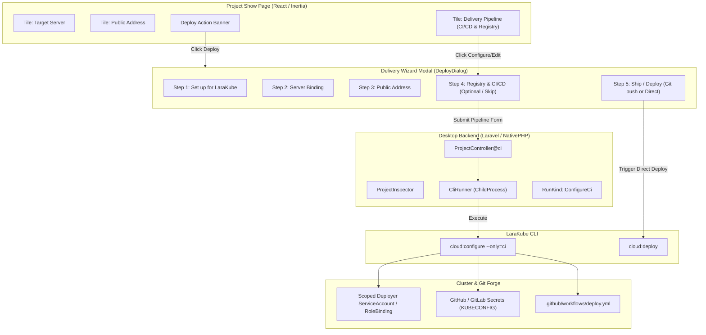

# Cloud Configure UI & Deploy Reconciliation Plan

## Executive Summary
The LaraKube CLI contains a comprehensive cloud configuration command (`cloud:configure`, defined in `cli/app/Commands/Cloud/CloudConfigureCommand.php` and `cli/app/Traits/ConfiguresCloudEnvironment.php`). It establishes:
1. **Deploy Target & Base Overlays** (`--only=base`): Managed Kubernetes context or VPS IP.
2. **Client-Facing Hostnames** (`--only=hosts`): Web domain, Reverb WebSockets, S3/CDN endpoints.
3. **Plex Commons** (`maybeJoinCommons`): Shared backing databases, Redis, Meilisearch, S3 storage.
4. **Container Registry** (`--only=registry`): GHCR, Docker Hub, GitLab Registry, Forgejo, or GAR.
5. **CI/CD Pipeline & Scoped Secrets** (`--only=ci`): Forge detection (`github`, `gitlab`, `forgejo`), automated workflow generation (`.github/workflows/deploy.yml` or `.gitlab-ci.yml`), scoped ServiceAccount and RBAC token creation (`createScopedDeployerAccount`), secret uploading via CLI tools (`gh secret set`, `tea secret set`), security audit policies (Trivy, Semgrep, Gitleaks, Pest tests), and secret rotation (`--rotate`).

Currently, the Desktop UI (`desktop/resources/js/pages/projects/show.tsx`) only surfaces Target Server, Public Address, and Commons backing services. Its **"Deploy"** button performs a direct manual build-and-ship operation from the developer's workstation via the local Docker daemon (`cloud:deploy`).

This plan outlines how to integrate `cloud:configure` into the Desktop UI and reconcile it with manual deployment, based on the `/grill-me` alignment interview.

---

## Key Design Decisions (Settled via `/grill-me`)

| Decision Area | Alignment Outcome |
| :--- | :--- |
| **1. UI Positioning** | **Step-by-Step Delivery Wizard**: Expand the existing 4-step `DeployDialog` into a 5-step delivery wizard (`Framework` → `Server` → `Address` → `Registry & CI/CD` → `Deploy/Ship`). |
| **2. CI/CD Step Requirement** | **Optional Gate with Dual Completion**: The "Registry & CI/CD" step allows developers to configure git-driven automation OR click *"Skip to Direct Deploy"* to ship manually right away. |
| **3. Project Overview Card** | **Dedicated Pipeline Tile**: Add a 3rd tile on `CloudEnvironmentOverviewCard` alongside "Target Server" and "Public Address" showing CI/CD status (e.g. `GitHub Actions · main · GHCR` or `Not configured`) with a `Configure / Edit` action. |
| **4. Pipeline Configuration Form** | **Sensible Defaults with Expandable Security Gates**: Auto-detect Git forge from remote, pre-fill image repo and branch (`main`), with an expandable accordion for toggling Semgrep, Trivy, Gitleaks, PHPUnit/Pest tests, and Strict mode. |
| **5. Deploy Banner Reconciliation** | **Git Push Banner with Manual Deploy Fallback**: When CI/CD is active, the banner states *"Automated CI/CD is active on main — push commits to deploy"*, while the action button provides *"Deploy from Mac (Manual)"* and opens the wizard to inspect steps or rotate secrets. |

---

## Architectural Workflow & Data Flow



---

## Implementation Specifications

### 1. Backend Data Inspection (`ProjectInspector.php`)
Enhance `desktop/app/Services/LaraKube/ProjectInspector.php` to extract CI/CD and Registry metadata for each environment:
- **Registry Data**: Read `$blueprint['environments'][$name]['registry']` (provider, image repository, registry host).
- **Git Forge & Remote Detection**:
  - Run `git remote get-url origin` in the project directory.
  - Parse the forge platform (`github`, `gitlab`, `forgejo`).
  - Extract the repository slug (e.g. `owner/repo`).
- **Workflow Existence**:
  - Check if `.github/workflows/deploy.yml` (or `.gitlab-ci.yml`) exists.
- **Security Audit Policy**:
  - Read `$blueprint['environments'][$name]['securityAudit']` (or return defaults).
- **Expose to Inertia**:
  ```php
  'ci' => [
      'platform' => $ciPlatform,
      'repoSlug' => $repoSlug,
      'hasWorkflow' => file_exists("{$path}/.github/workflows/deploy.yml") || file_exists("{$path}/.gitlab-ci.yml"),
      'branch' => 'main',
      'registry' => $envConfig['registry'] ?? null,
      'securityAudit' => $envConfig['securityAudit'] ?? null,
  ],
  ```

### 2. Desktop Backend Controller & Execution (`ProjectController.php` & `RunKind`)
1. **Enum Update**:
   - Ensure `App\Enums\RunKind` contains `ConfigureCi = 'configure-ci'` with human-readable label and icon mapping.
2. **Controller Action**:
   - Add `public function configureCi(Request $request, Project $project, CliRunner $runner)`:
     - Validate inputs:
       - `environment`: `alpha_dash` (default: `'production'`)
       - `registry`: `in:ghcr,dockerhub,gitlab,forgejo,gar`
       - `image`: nullable string
       - `branch`: string (default: `'main'`)
       - `strict`: boolean
       - `skip_audit`: boolean
       - `with_tests`: boolean
       - `no_gitleaks`: boolean
       - `no_semgrep`: boolean
       - `no_trivy`: boolean
       - `rotate`: boolean (for secret rotation)
     - Construct CLI arguments:
       ```php
       $args = ['cloud:configure', $environment, '--only=ci'];
       if ($request->boolean('rotate')) $args[] = '--rotate';
       if ($request->filled('registry')) $args[] = "--registry={$request->input('registry')}";
       if ($request->filled('image')) $args[] = "--image={$request->input('image')}";
       if ($request->filled('branch')) $args[] = "--branch={$request->input('branch')}";
       if ($request->boolean('strict')) $args[] = '--strict';
       if ($request->boolean('skip_audit')) $args[] = '--skip-audit';
       if ($request->boolean('with_tests')) $args[] = '--with-tests';
       if ($request->boolean('no_gitleaks')) $args[] = '--no-gitleaks';
       if ($request->boolean('no_semgrep')) $args[] = '--no-semgrep';
       if ($request->boolean('no_trivy')) $args[] = '--no-trivy';
       ```
     - Dispatch via `CliRunner::start()` with `RunKind::ConfigureCi`.

### 3. Frontend UI Components (`projects/show.tsx`)

#### A. Cloud Environment Overview Card Update
Update `CloudEnvironmentOverviewCard` from a 2-column grid to a 3-column grid (`grid-cols-1 md:grid-cols-3`):
1. **Target Server Tile**: Server name, IP, "Change" button.
2. **Public Address Tile**: Hostname, SSL indicator, "Edit" button.
3. **Delivery Pipeline Tile (New)**:
   - Header: `DELIVERY PIPELINE` with `GitBranch` / `Workflow` icon.
   - Body:
     - If configured:
       - Forge logo/badge (GitHub Actions / GitLab CI)
       - Branch (e.g. `main`) & Registry (`ghcr.io/owner/repo`)
       - Action: "Reconfigure" button + "Rotate Secrets" button.
     - If not configured:
       - "No automated CI/CD configured."
       - Action: "Set up CI/CD" button (opens wizard at Step 4).

#### B. Deploy Action Banner Update
Update the banner text and button behavior based on CI/CD status:
- **When CI/CD is active**:
  - Banner text: *"Automated CI/CD is active on `main`. Push commits to Git to deploy, or trigger a manual deploy from this Mac."*
  - Primary button: `<Play /> Deploy from Mac (Manual)`
  - Secondary action link: *"View CI/CD configuration"*
- **When CI/CD is not active**:
  - Banner text: *"Ready to deploy to {server}. Click Deploy to ship."*
  - Primary button: `<Play /> Deploy to {ENV}`

#### C. DeployDialog Expansion (5 Steps)
Expand `DeployDialog`:
- **Step 1**: Framework Setup (`InitForm`)
- **Step 2**: Server Binding (`LinkServerForm`)
- **Step 3**: Public Address (`HostForm`)
- **Step 4: Delivery & CI/CD Pipeline (New)**:
  - Header: `Delivery Pipeline ({ENV})`
  - Explanatory copy: *"Automate deployments on every git push, or deploy manually from your computer."*
  - Two modes / accordion:
    - **Mode A: Automated Git CI/CD (Recommended)**:
      - Detects remote repository.
      - Inputs: Registry Provider (`GHCR` default for GitHub, etc.), Image Name (`owner/repo`), Branch (`main`).
      - Collapsible *"Security Gates & Audit"* panel:
        - Checkbox: Run PHPUnit/Pest test suite (`--with-tests`)
        - Checkbox: Secret scanning (`Gitleaks`)
        - Checkbox: Static analysis (`Semgrep`)
        - Checkbox: Vulnerability scanning (`Trivy`)
        - Checkbox: Strict security gate (fail on HIGH) (`--strict`)
      - Button: `<Workflow /> Generate Workflow & Push Secrets` (submits to `configureCi`).
    - **Mode B: Skip CI/CD**:
      - Button: `<ArrowRight /> Skip to Direct Deploy` (marks Step 4 as skipped and advances to Step 5).
- **Step 5: Ship / Deploy**:
  - If CI/CD configured:
    - Display helper block: *"Push your commits to origin/{branch} to trigger the automated build pipeline."*
    - Fallback button: `<Play /> Deploy from Mac now (Direct Deploy)`.
  - If CI/CD skipped:
    - Standard manual deployment button: `<Play /> Deploy to {ENV}`.

---

## Safety, Idempotency & Conventions
1. **Idempotency**: Running `cloud:configure --only=ci` multiple times updates the existing secret values and overwrites the workflow file without creating duplicate secrets.
2. **Non-Interactive Flags**: All parameters are passed explicitly as command-line flags to prevent interactive terminal hangs under `--no-interaction`.
3. **Button Icons**: All action buttons in the UI must feature Lucide icons (`<Play />`, `<Workflow />`, `<RotateCw />`, `<ShieldCheck />`, `<GitBranch />`).
4. **Zero Live Patching**: All actions operate strictly through LaraKube CLI commands.

---

## Verification & Testing Plan
1. **Feature Tests**:
   - Test `ProjectController::configureCi` validation and command dispatch in `desktop/tests/Feature/ProjectControllerTest.php`.
   - Test `ProjectInspector::inspect` reading registry and git workflow status.
2. **Lint & Static Analysis**:
   - Proactively run `composer format` (Pint + Rector).
   - Proactively run `composer analyse` (PHPStan).
   - Run `composer test` to ensure all desktop tests pass.
   - Run `vp check` / TypeScript compiler check on `projects/show.tsx`.
3. **Manual Verification Instruction**:
   - Instruct the user to run `./build` and test the Delivery Wizard and Pipeline tile in LaraKube Desktop.
