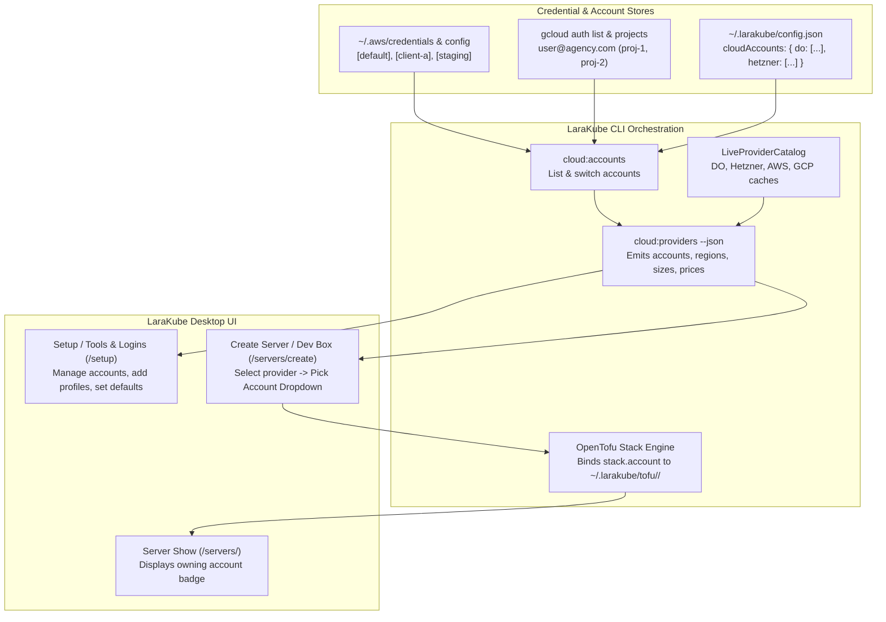

# Architectural Plan: Cloud Multi-Account Switcher & API-Driven Catalog

## Goal Description
Professional developers and agencies frequently manage multiple cloud accounts across clients and environments (e.g., separate AWS profiles, different GCP organization projects, or dedicated DigitalOcean/Hetzner API tokens). Currently, LaraKube only supports a single active credential per provider on Desktop, while AWS/GCP regions, machine sizes, and prices are largely hardcoded as static constants in the source code rather than driven by dynamic provider APIs.

This plan delivers a unified two-phase upgrade:
1. **Phase 1: Universal Cloud Multi-Account Management & Switching** across all 4 supported providers (AWS, GCP, DigitalOcean, Hetzner) in both CLI and LaraKube Desktop.
2. **Phase 2: API-Driven Live Provider Catalog & Dynamic Pricing** for AWS and GCP, matching the existing live catalog capabilities of DigitalOcean and Hetzner.

---

## User Review Required

> [!IMPORTANT]
> **Backward Compatibility**: Existing single-token setups (`doToken`, `hetznerToken`, default `~/.aws/credentials`, `gcloud` active account) will automatically migrate and register as the initial default account for that provider with zero disruption to active servers.

> [!NOTE]
> **AWS & GCP IAM Policy Requirements**:
> Phase 2 queries live available regions and instance types using `ec2:DescribeRegions` and `ec2:DescribeInstanceTypes` for AWS, and `compute.regions.list` / `compute.machineTypes.list` for GCP. These actions are read-only and already covered under the standard LaraKube minimal deployment policies.

---

## Architecture Overview



---

## Proposed Changes

### Phase 1: Universal Cloud Multi-Account Switcher

#### 1. CLI Core Data & Config

##### [MODIFY] `cli/app/Data/GlobalConfigData.php`
- Add `public array $cloudAccounts = []` to store named accounts for DO & Hetzner:
  ```php
  /**
   * Named accounts registry for token-based cloud providers (do, hetzner).
   * Shape: ['do' => [['id' => 'do-1', 'name' => 'Agency Main', 'token' => '...', 'default' => true]], ...]
   *
   * @var array<string, list<array{id: string, name: string, token: string, default: bool, createdAt: string}>>
   */
  public array $cloudAccounts = [],
  ```
- Add helper methods:
  - `getCloudAccounts(string $provider): array`
  - `addCloudAccount(string $provider, string $name, string $token, bool $asDefault = false): string`
  - `removeCloudAccount(string $provider, string $id): bool`
  - `setDefaultCloudAccount(string $provider, string $id): bool`
  - `getDefaultCloudAccount(string $provider): ?array`
- Automatic back-compat migration: if `$this->doToken` or `$this->hetznerToken` exists and `$this->cloudAccounts[$provider]` is empty, initialize a default entry (`"Default Account"`).

##### [MODIFY] `cli/app/Traits/InteractsWithAws.php`
- Enhance `listAwsProfiles()` to extract caller identity (account ID and ARN) alongside profile names.
- Provide `getAwsProfilesWithMetadata(): array` returning `list<array{profile: string, accountId: ?string, arn: ?string, isDefault: bool}>`.

##### [MODIFY] `cli/app/Traits/InteractsWithGcp.php`
- Enhance `listGcpAccounts()` and project discovery:
  - Return `list<array{account: string, isActive: bool, projects: list<string>}>`.

##### [NEW] `cli/app/Commands/Cloud/CloudAccountsCommand.php`
- Command: `cloud:accounts {--provider=} {--set-default=} {--add} {--remove=} {--json}`
- Lists all discovered/configured accounts across AWS, GCP, DO, Hetzner with status pills and active indicators.
- Allows switching the active profile or adding a new named account.

##### [MODIFY] `cli/app/Commands/Cloud/CloudCredentialsCommand.php`
- Expand `--provider=aws` to support `--profile=`: saves credentials under a named AWS profile in `~/.aws/credentials` without overwriting `default`.
- Add `--provider=do` and `--provider=hetzner` support with `--name=` flag to save named tokens into `$cloudAccounts`.

##### [MODIFY] `cli/app/Commands/Cloud/CloudProvidersCommand.php`
- Enrich JSON output to include multi-account information:
  ```json
  "credentials": {
    "ready": true,
    "hint": null,
    "activeAccount": "client-acme",
    "accounts": [
      { "id": "default", "label": "Default (112233445566)", "isDefault": false },
      { "id": "client-acme", "label": "Client ACME (998877665544)", "isDefault": true }
    ]
  }
  ```

##### [MODIFY] `cli/app/Commands/Cloud/CloudCreateCommand.php` & `DevboxCreateCommand.php`
- Accept `--do-account=`, `--hetzner-account=`, `--aws-profile=`, `--gcp-account=`.
- Persist the selected account ID into `StackData::$account` so the stack permanently tracks its owner.

##### [MODIFY] `cli/app/Commands/Cloud/CloudDestroyCommand.php` & `CloudScaleCommand.php`
- When destroying or scaling a stack, inspect `$stack->account`:
  - If AWS: automatically use `AWS_PROFILE={$stack->account}`.
  - If GCP: automatically use `CLOUDSDK_CORE_PROJECT={$stack->projectId}` and set GCP account.
  - If DO/Hetzner: look up token from `$cloudAccounts` by ID/name before falling back to default token.

---

#### 2. Desktop UI & Controller Layer

##### [NEW] `desktop/app/Http/Controllers/CloudAccountController.php`
- Endpoints:
  - `POST /setup/cloud/accounts/default`: Set default account for a provider.
  - `POST /setup/cloud/accounts/add`: Add named profile or token.
  - `DELETE /setup/cloud/accounts/{provider}/{id}`: Remove named account.

##### [MODIFY] `desktop/resources/js/pages/readiness.tsx`
- In the "Cloud accounts" section:
  - Display an account badge/dropdown showing the active account (e.g. `AWS: client-acme`, `GCP: dev@agency.com (my-project)`).
  - Add an "Account Switcher" popup or modal allowing operators to:
    - Switch active default account.
    - Add a new named AWS profile (access key, secret key, region, profile name).
    - Add a new DigitalOcean or Hetzner named token.
    - Switch GCP active account/project.

##### [MODIFY] `desktop/resources/js/pages/servers/create.tsx`
- Under the provider selection, render an **Account / Profile Selector**:
  - Shows all available accounts for the selected provider with account ID/label.
  - Defaults to the active account.
  - Allows selecting a specific client account for this server run.
  - Provides an "+ Add new account" button that opens the inline credential modal.
- Form passes `account` (and `project_id` for GCP) to `ServerController::store()`.

##### [MODIFY] `desktop/resources/js/pages/servers/show.tsx`
- Display a dedicated **Cloud Account** info chip in the Server Overview header (e.g. `Provider: AWS · Account: client-acme · Region: us-east-1`).

---

### Phase 2: API-Driven Live Provider Catalog (AWS & GCP)

#### 1. Live Catalog Extension

##### [MODIFY] `cli/app/Services/Cloud/LiveProviderCatalog.php`
- Extend `LiveProviderCatalog` to handle `CloudProvider::AWS` and `CloudProvider::GCP`:
  - **AWS**:
    - Query live regions via `aws ec2 describe-regions --all-regions --query "Regions[?OptInStatus!='not-opted-in'].RegionName"`.
    - Query live instance type specifications via `aws ec2 describe-instance-types`.
    - Combine with cached regional hourly-to-monthly pricing matrix, cached in `~/.larakube/cache/aws-catalog.json`.
  - **GCP**:
    - Query live regions via `gcloud compute regions list --format=json`.
    - Query machine types via `gcloud compute machine-types list`.
    - Combine with regional pricing matrix, cached in `~/.larakube/cache/gcp-catalog.json`.
- Freshness threshold: 6 hours (fresh), fallback up to 14 days (stale), with automatic graceful degradation to built-in constants if offline.

---

## Verification Plan

### Automated Tests
1. **CLI Tests**:
   - `composer test -- --filter=CloudAccountsCommandTest`: Verify listing, adding, removing, and switching accounts across all 4 providers.
   - `composer test -- --filter=CloudProvidersCommandTest`: Verify `cloud:providers --json` emits accounts array and live catalog data.
   - `composer test -- --filter=CloudCreateAwsMultiAccountTest`: Verify `--aws-profile` and transient account propagation to OpenTofu.
   - `composer test -- --filter=LiveProviderCatalogTest`: Verify live catalog parsing, disk caching, and fallback handling for AWS & GCP.
2. **Desktop Tests**:
   - `cd desktop && ./vendor/bin/pest`: Verify all controller routes and inertia assertions pass.
   - `cd desktop && npm run check`: Biome formatting and lint check.
   - `cd desktop && npm run types:check`: TypeScript compilation check.

### Manual Verification
1. Open LaraKube Desktop Setup (`/setup`):
   - Verify AWS, GCP, DO, and Hetzner display active accounts.
   - Click "Switch Account" or "Add Profile" to verify adding a new named account.
2. Navigate to "Create a server" (`/servers/new`):
   - Pick AWS -> Verify account switcher dropdown lists all profiles from `~/.aws/credentials`.
   - Select an alternative profile -> Verify instance creation attaches that account to the stack.
3. Inspect `~/.larakube/config.json`:
   - Confirm `tofu/<stack-name>/` and global stack metadata record the proper `account` identifier.
