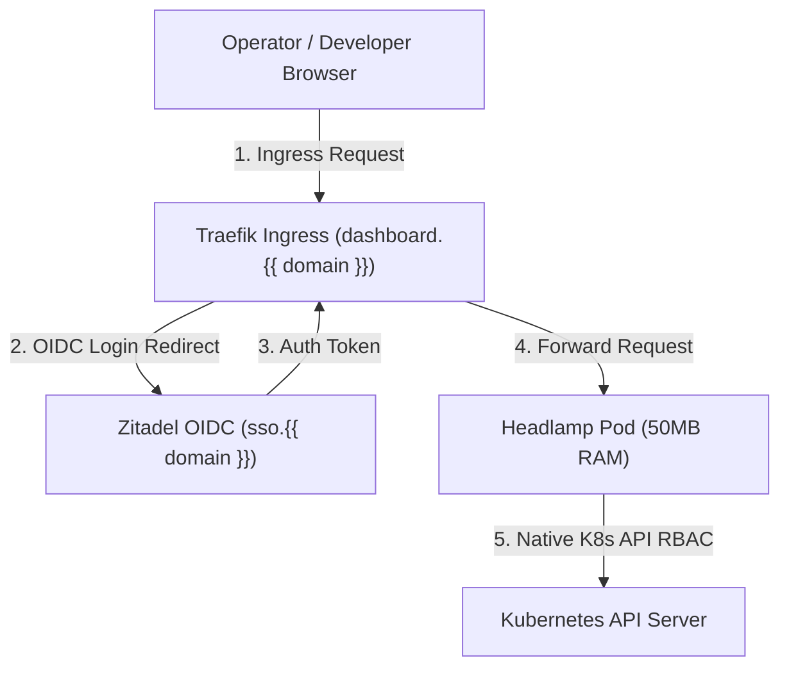

# Plan: CNCF Headlamp Kubernetes Control Plane (`dashboard:init`)

**Status:** Proposed Active Plan
**Created:** 2026-08-04
**Target Version:** LaraKube CLI v1.2.0

---

## 🎯 Objective

Introduce `dashboard:init` and `dashboard:remove` commands to deploy **Headlamp (CNCF Kubernetes SIG UI)** as LaraKube's official, open-source, ultra-lightweight (~50MB RAM) Kubernetes web control plane.

---

## 🏛 Real-World Grounded Architecture

---

## 🔧 Component Specifications

### 1. Headlamp CNCF Web UI
- **Image**: `ghcr.io/headlamp-k8s/headlamp:v0.24.0`
- **RAM Footprint**: ~50MB
- **OIDC SSO Integration**: Configured with `--oidc-idp-issuer-url`, `--oidc-client-id`, and `--oidc-client-secret` auto-hydrated from Zitadel (`readSsoWiredOidc()`).
- **Ingress Host**: `dashboard.{{ $domain }}`

---

## 📋 Implementation Checklist

- [ ] Create `cli/app/Commands/Dashboard/DashboardInitCommand.php`
- [ ] Create `cli/app/Commands/Dashboard/DashboardRemoveCommand.php`
- [ ] Create `cli/app/Concerns/InteractsWithDashboard.php`
- [ ] Create `cli/resources/views/k8s/dashboard/headlamp.blade.php`
- [ ] Create Pest feature tests (`cli/tests/Feature/DashboardInitCommandTest.php`)
- [ ] Run Pest unit tests & static analysis (`./php vendor/bin/phpstan`)

---

## ✅ Definition of Done

- `larakube dashboard:init` deploys CNCF Headlamp into `larakube-shared`.
- Logging in via `https://dashboard.{{ domain }}` redirects seamlessly to Zitadel OIDC (`sso.{{ domain }}`).
- Pod logs, shell terminal access, and cluster telemetry display cleanly in browser.
- Re-running `dashboard:init` is strictly idempotent.
