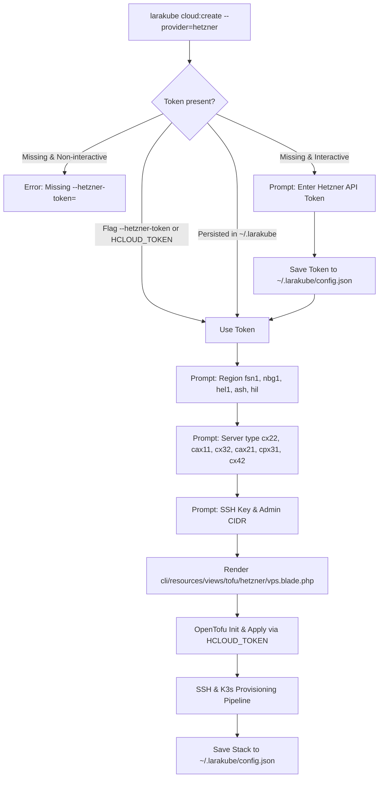

# Implementation Plan: Hetzner Cloud (`hetzner`) Provider Integration

**Status:** 📋 PROPOSED (Implementation in progress)  
**Target Commands:** `cloud:create`, `cloud:scale`, `cloud:destroy`, `cloud:stacks`, `setup`  
**Provider:** Hetzner Cloud (`hetzner`)

---

## 🎯 Executive Summary & Objectives

Hetzner Cloud is the leading European cloud provider, renowned for high-performance NVMe virtual servers at 70–85% lower cost than AWS, GCP, or DigitalOcean (e.g. 2 vCPU, 4 GB RAM for ~€3.80/month).

This plan integrates Hetzner Cloud as a first-class cloud provider in LaraKube:
1. **API Token & Auth**: `--hetzner-token=` flag, `HCLOUD_TOKEN` environment variable, and persisted token in `~/.larakube/config.json`.
2. **CLI Tooling (`hcloud`)**: Add `hcloud` to `App\Enums\CliTool` with automated installation (`brew install hcloud` on macOS, binary download on Linux).
3. **OpenTofu Provider**: Provision single-node k3s VPS via `hetznercloud/hcloud` (~> 1.48) with automated firewall rules and SSH key registration.
4. **Day-2 Ops**: Support server type scaling in `cloud:scale`, resource destruction in `cloud:destroy`, and stack visibility in `cloud:stacks`.
5. **Strict Tests & Quality**: Full test suite coverage (`CloudCreateHetznerTest.php`), Pint formatting, PHPStan passing with 0 errors.

---

## 📐 Architecture & Flow

---

## 🛠️ File Changes

### 1. `cli/app/Enums/CloudProvider.php` [MODIFY]
- Add regions for `self::HETZNER`: `fsn1` (Falkenstein), `nbg1` (Nuremberg), `hel1` (Helsinki), `ash` (Ashburn US), `hil` (Hillsboro US).
- Set `defaultRegion()` to `fsn1`.
- Add `vpsSizes()`: `cx22` (default), `cax11`, `cx32`, `cax21`, `cpx31`, `cx42`.
- Set `defaultVpsSize()` to `cx22`.
- Add `self::HETZNER->value => self::HETZNER->label()` to `activeProviders()`.

### 2. `cli/app/Enums/CliTool.php` [MODIFY]
- Add `case HCLOUD = 'hcloud';`
- Implement label, description, candidate paths, and installation for macOS (`brew install hcloud`) and Linux.

### 3. `cli/app/State.php` [MODIFY]
- Add `public static ?string $transientHetznerToken = null;`

### 4. `cli/app/Data/GlobalConfigData.php` [MODIFY]
- Add `public ?string $hetznerToken = null;`
- Add `getHetznerToken(): ?string` and `setHetznerToken(?string $token): void`.

### 5. `cli/app/Traits/InteractsWithGlobalConfig.php` [MODIFY]
- Add `getHetznerToken(): ?string` (checks transient, env `HCLOUD_TOKEN`, global config).
- Add `setHetznerToken(?string $token): void`.

### 6. `cli/app/Traits/InteractsWithHetzner.php` [CREATE]
- Implement `ensureHetznerToken(): bool`.
- Handles flags, env, global config, interactive prompt, and token secret registration.

### 7. `cli/app/Traits/InteractsWithOpenTofu.php` [MODIFY]
- In `tofuEnv()`: inject `HCLOUD_TOKEN` and `TF_VAR_hcloud_token`.

### 8. `cli/resources/views/tofu/hetzner/vps.blade.php` [CREATE]
- Define `required_providers` with `hetznercloud/hcloud`.
- Define `hcloud_ssh_key` (matching existing keys or creating new).
- Define `hcloud_firewall` (inbound SSH, HTTP, HTTPS, k3s API + full outbound).
- Define `hcloud_server` with `ubuntu-24.04`, server_type, location, ssh_keys, firewall_ids.
- Outputs `ip` and `id`.

### 9. `cli/app/Commands/Cloud/CloudCreateCommand.php` [MODIFY]
- Add `use InteractsWithHetzner;`
- Add `{--hetzner-token= : Hetzner Cloud API token for this run only}` to signature.
- Add `'hetzner' => 'Hetzner Cloud'` to `PROVIDERS` constant.
- In `ensureProviderToken`: delegate to `ensureHetznerToken()`.
- Reject `--managed` if provider is `hetzner` with clear message (VPS only).

### 10. `cli/app/Commands/Cloud/CloudScaleCommand.php` [MODIFY]
- Add `use InteractsWithHetzner;`
- Add `{--hetzner-token= : Hetzner Cloud API token}` to signature.
- In `ensureProviderToken`: delegate to `ensureHetznerToken()`.
- In `scale()`: replace `server_type = "..."` in `main.tf`.

### 11. Feature Tests [CREATE]
- `cli/tests/Feature/CloudCreateHetznerTest.php`:
  - Flag validation and `--no-interaction` checks.
  - Token handling (env, flag, prompt).
  - OpenTofu template rendering (server, firewall with admin CIDR, ssh key).
  - Scale command updates `server_type`.

---

## 🧪 Verification Plan
- Run `./vendor/bin/pest tests/Feature/CloudCreateHetznerTest.php`
- Run `./vendor/bin/pint`
- Run `php -d memory_limit=2G ./vendor/bin/phpstan analyse --no-progress`
- Run full Pest test suite (2,630+ tests)
