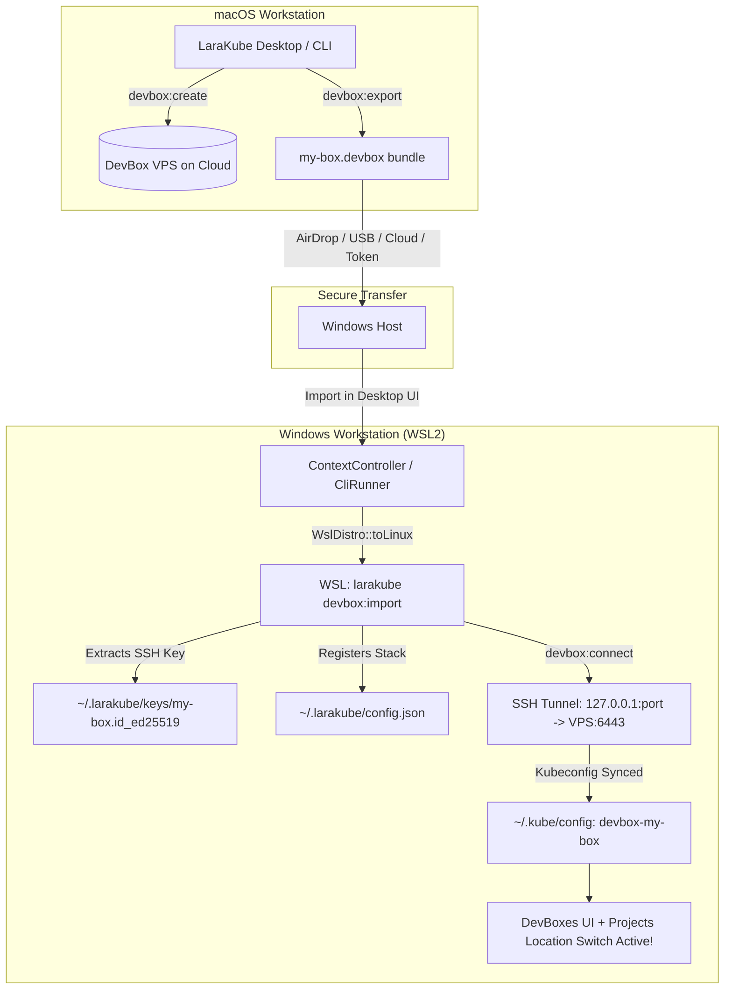

# Implementation Plan: Kubeconfig Cross-Platform Import & DevBox Sharing Architecture

> [!NOTE]
> **Status: COMPLETED & VERIFIED (Ready for `./build`)**
> - **CLI Implementation**: `DevBoxBundle` (AES-256-GCM + PBKDF2), `devbox:export`, `devbox:import`, `devbox:grant`, and `devbox:revoke` commands. Committed in `cli/` (`678a1ebb`, 3,102 tests passed).
> - **Desktop Implementation**: `DevBoxImportModal`, `DevBoxExportModal`, `DevBoxGrantModal`, Collaborators & Access card in `show.tsx`, Import button in `index.tsx`, controller endpoints with Windows/WSL path translation. Committed in `desktop/` (`e8f155e`, 351 tests passed, lint & type checks 0 errors).

## Goal Description
1. **Verify & Fix Cross-Platform "Import Kubeconfig" (macOS ↔ Windows/WSL)**:
   Ensure clusters and kubeconfigs exported on macOS (or any machine) can be cleanly imported into LaraKube Desktop on Windows, eliminating path conversion failures between Windows and WSL.
2. **Architect & Implement DevBox Sharing**:
   Design a first-class way to share and synchronize DevBoxes between machines (e.g. macOS workstation ↔ Windows desktop) and teammates, including stack registration, SSH credentials, and tunnel management.

---

## User Review Required

> [!IMPORTANT]
> **Why DevBoxes Currently Cannot Be Shared via Kubeconfig Import Alone:**
> DevBoxes created via `devbox:create` only open **SSH port 22** on their firewall. The Kubernetes API server (port 6443) runs strictly on `127.0.0.1:6443` on the remote VPS.
> On the creating machine (e.g. macOS), LaraKube runs an SSH tunnel (`devbox:connect` forwarding local port to remote 6443) and points the local kubeconfig to `https://127.0.0.1:<local-port>`.
> If you simply export that kubeconfig to Windows, Windows has no SSH tunnel running and will fail to connect. Furthermore, the DevBox UI (`devboxes/show`, `projects/index` Location Switch) requires the stack to be registered in `~/.larakube/config.json` with its SSH private key.
> **Solution**: We introduce a dedicated DevBox sharing mechanism (`devbox:export` / `devbox:import` and Desktop UI) that bundles or connects the stack, SSH key, and tunnel automatically.

---

## Open Questions

> [!NOTE]
> 1. **DevBox Bundle Security**: Should `devbox:export` support optional passphrase encryption (e.g. AES-256-GCM using OpenSSL) so operators can safely transfer `.devbox` bundles over Slack, email, or USB?
> 2. **Direct VPN Alternative**: Would you like DevBoxes to optionally support joining your NetBird VPN network (`vpn:wire` on the devbox) so all devices on your NetBird mesh can reach the devbox directly without SSH tunnels?

---

## Proposed Changes



---

### Component 1: Cross-Platform Kubeconfig Import Fixes

#### [MODIFY] `desktop/app/Http/Controllers/ContextController.php`
- **Issue**: On Windows, `$path` from file upload/paste or native file picker is a Windows path (e.g. `C:\Users\...\AppData\Roaming\LaraKube\storage\framework\temp\kubeconfigs\import-...` or `C:\Users\...\Downloads\cluster.kubeconfig`). Passing this raw Windows path to `CliRunner` causes the CLI in WSL Linux to fail with `is_file('C:\...') == false`.
- **Fix**:
  - Normalize `$path` to a Linux path before spawning the CLI:
    ```php
    $cliPath = app(ToolLocator::class)->isWindows() ? WslDistro::toLinux($path) : $path;
    ```
  - Apply the same normalization to `$file` in `ContextController::restore`.

#### [MODIFY] `cli/app/Commands/ContextImportCommand.php` & `ContextRestoreCommand.php`
- **Defensive Resilience**: In case a user or tool runs `larakube context:import C:\Users\...` directly inside WSL or a shell:
  ```php
  if (PHP_OS_FAMILY === 'Linux' && preg_match('#^([a-zA-Z]):[\\\\/](.*)$#', $file, $drive)) {
      $wslPath = '/mnt/' . strtolower($drive[1]) . '/' . str_replace('\\', '/', $drive[2]);
      if (is_file($wslPath)) {
          $file = $wslPath;
      }
  }
  ```

---

### Component 2: DevBox Sharing CLI Commands (`cli/`)

#### [NEW] `cli/app/Commands/Cloud/DevboxExportCommand.php`
- **Signature**: `devbox:export {name : Name of the dev box} {--output= : Path to output .devbox bundle file} {--password= : Optional encryption passphrase} {--json}`
- **Behavior**:
  - Finds the stack in `~/.larakube/config.json`.
  - Verifies stack role is `dev`, with valid IP and SSH private key.
  - Bundles stack metadata (`name`, `provider`, `region`, `ip`, `sshUser`, `channel`) along with the SSH private key content into a portable JSON structure (optionally encrypted with AES-256-GCM if `--password` is provided).
  - Writes to `<name>.devbox` (or specified `--output`) and returns the path.

#### [NEW] `cli/app/Commands/Cloud/DevboxImportCommand.php`
- **Signature**: `devbox:import {file : Path to .devbox bundle file} {--password= : Passphrase if encrypted} {--name= : Optional override for devbox name} {--json}`
- **Behavior**:
  - Decrypts and parses the `.devbox` bundle.
  - Writes the SSH private key securely into `~/.larakube/keys/<name>.id_ed25519` (permissions `0600`).
  - Registers the stack in `~/.larakube/config.json`.
  - Automatically invokes `devbox:connect` to verify SSH access, launch the SSH tunnel to K3s port 6443, and configure the local `devbox-<name>` kube-context.
  - Outputs success message and context name.

#### [NEW] `cli/app/Commands/Cloud/DevboxAttachCommand.php`
- **Signature**: `devbox:attach {name : Name for the dev box} {--ip= : Public IP address of the box} {--key= : Path to SSH private key} {--user=larakube} {--json}`
- **Behavior**:
  - Directly attaches an existing remote dev box given an IP address and SSH key.
  - Copies the SSH key to `~/.larakube/keys/<name>.id_ed25519`.
  - Registers the stack and establishes the tunnel via `devbox:connect`.

---

### Component 3: Desktop UI for DevBox Sharing (`desktop/`)

#### [MODIFY] `desktop/resources/js/pages/devboxes/index.tsx`
- Add an **"Import Dev Box"** button alongside "Create dev box" in the page header actions with `Download` and `Laptop` icons.
- Opens an **ImportDevBoxModal** supporting file selection (`.devbox`) or manual attach (Name, IP, SSH key).

#### [MODIFY] `desktop/resources/js/pages/devboxes/show.tsx`
- Add a **"Share Dev Box"** action in the header menu / quick actions.
- Displays an export dialog with:
  - Download `.devbox` bundle button.
  - Optional passphrase protection.
  - Quick instruction on how to import it on another computer (e.g., Windows or teammate workstation).

#### [MODIFY] `desktop/app/Http/Controllers/DevBoxController.php`
- Add `export()` endpoint: calls `larakube devbox:export <box> --output=<path>`.
- Add `import()` endpoint: accepts `.devbox` file, translates Windows paths via `WslDistro::toLinux()`, and runs `larakube devbox:import <path>`.

---

## Verification Plan

### Automated Tests
1. **Context Import Path Translation Test**:
   - `desktop/tests/Feature/ContextControllerTest.php`:
     - Test `POST /context/import` with Windows drive path (`C:\Users\test\config.yaml`) ensuring `WslDistro::toLinux` translates the path to `/mnt/c/Users/test/config.yaml`.
2. **CLI DevBox Export/Import Tests**:
   - `cli/tests/Feature/DevboxExportImportTest.php`:
     - Create a mock devbox stack in global config.
     - Run `larakube devbox:export test-box --output=test-box.devbox`.
     - In an isolated environment, run `larakube devbox:import test-box.devbox`.
     - Assert stack is registered in config, SSH key is placed with 0600 permissions, and tunnel connect is triggered.
3. **Full Desktop Test Suite**:
   - Run `composer test` and `npm run check && npm run types:check` in `desktop/`.

### Manual Verification
1. **Public Cloud Cluster Import on Windows**:
   - Copy a kubeconfig for a public VPS / cloud cluster (DOKS / GCP) onto Windows (e.g. `C:\Users\...\Downloads\cluster.kubeconfig`).
   - Click "Import Kubeconfig" in LaraKube Desktop on Windows, choose the file, and click Import.
   - Verify context is imported into WSL's `~/.kube/config` and shows up in LaraKube Servers dashboard.
2. **DevBox Export on macOS & Import on Windows**:
   - On macOS, open Dev Box `test-dev-box` and click "Share Dev Box". Save `test-dev-box.devbox`.
   - Copy `test-dev-box.devbox` to the Windows machine.
   - On Windows LaraKube Desktop, click "Import Dev Box", select `test-dev-box.devbox`.
   - Verify `test-dev-box` appears in the Dev Boxes list, the SSH tunnel opens, and projects on `test-dev-box` can be inspected and operated.
