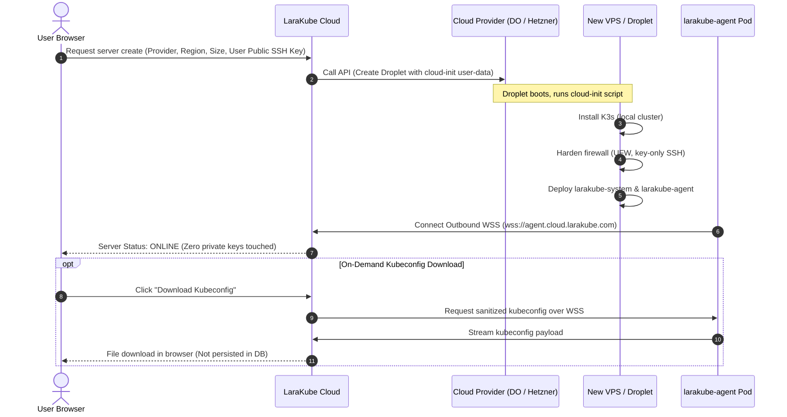

# LaraKube Cloud Architecture: Zero-Trust In-Cluster Agent & Sovereign Platform

## Goal Description
LaraKube Desktop and the LaraKube CLI provide a high-performance, developer-friendly orchestration experience for Kubernetes. However, desktop users must install and run local tooling (Docker, OrbStack, or NativePHP).

The objective of **LaraKube Cloud** is to deliver the full LaraKube experience in the browser: users log in, provision cloud servers across major cloud providers (DigitalOcean, Hetzner, AWS, GCP), install companion tools (OpenBao, SeaweedFS, PostgreSQL, Authentik, Uptime Kuma), and deploy Laravel applications with zero local installation required.

Crucially, LaraKube Cloud avoids the security vulnerabilities and architectural traps of traditional server panels (e.g. Laravel Forge, Ploi, RunCloud):
1. **Zero Root Credential Custody**: LaraKube Cloud does **not** store cluster-admin `kubeconfig` files or private SSH keys.
2. **Zero Inbound Attack Surface**: Clusters and servers keep their management ports (SSH port 22 and K8s API port 6443) firewalled from the public internet. All communication is initiated **outbound** from the customer's cluster via a persistent secure WebSocket (WSS) agent.
3. **Zero Lock-In & Total Sovereignty**: Customer clusters are 100% self-contained and declarative. If LaraKube Cloud goes offline or the customer cancels their subscription, their applications and companion services continue running without interruption.

---

## Architecture Overview

```mermaid
flowchart TD
    subgraph Browser ["User Browser"]
        WebUI["LaraKube Cloud Web UI\n(Inertia v3 + React 19)"]
        Terminal["Live Terminal / Log Stream\n(Laravel Echo)"]
    end

    subgraph Cloud ["LaraKube Cloud Platform (Laravel 13 + FrankenPHP)"]
        API["Cloud Web & API\n(Controllers & Auth)"]
        Reverb["Laravel Reverb\n(WSS Gateway)"]
        Worker["Provisioning Queue\n(Ephemeral OpenTofu Jobs)"]
        OpenBao["Cloud Vault\n(Encrypted Cloud Provider Tokens)"]
    end

    subgraph CustomerCloud ["Customer Infrastructure (DigitalOcean / Hetzner / AWS / GCP)"]
        subgraph Cluster ["Customer Kubernetes Cluster (K3s / Managed K8s)"]
            AgentPod["larakube-agent daemon\n(larakube-system namespace)"]
            K8sJob["Disposable Execution Pod\n(ghcr.io/larakube/cli <verb>)"]
            Workloads["App Pods & Companion Tools\n(OpenBao, Postgres, Uptime Kuma)"]
        end
    end

    WebUI -->|HTTPS / Actions| API
    API -->|Dispatch Job / Event| Reverb
    Reverb -->|Realtime Output Stream| Terminal
    API -->|Store/Retrieve API Token| OpenBao
    API -->|Queue VM Provisioning| Worker

    Worker -.->|1. cloud-init boots VM + Agent| CustomerCloud
    AgentPod ===>|2. Outbound Persistent WSS (mTLS/JWT)| Reverb
    Reverb ===>|3. Signed Task Payload| AgentPod
    AgentPod -->|4. Spawn batch/v1 Job| K8sJob
    K8sJob -->|5. Apply Manifests & Wiring| Workloads
    K8sJob -.->|6. Stdout/Stderr Log Stream| AgentPod
    AgentPod ===>|7. Stream Output Messages| Reverb
```

---

## 1. Threat Model & Security Comparison

| Dimension | Traditional Server SaaS (Forge, Ploi) | LaraKube Cloud (Zero-Trust Agent) |
| :--- | :--- | :--- |
| **Inbound Access** | Requires public SSH port 22 open to SaaS IPs. | **Zero inbound access required**. Port 22 and 6443 can be firewalled completely. |
| **Credential Storage** | SaaS database stores root SSH private keys for every user VM. | **Zero root SSH keys stored**. Cloud never touches private SSH keys. User supplies their own public key. |
| **Cluster Access** | SaaS stores root `cluster-admin` kubeconfig in central DB. | **Zero root kubeconfigs stored**. Cloud dispatches tasks to an in-cluster agent via signed tokens. |
| **Impact of SaaS Breach** | Catastrophic: Attackers get instant root SSH into every customer server worldwide. | **Contained**: No SSH keys or kubeconfig databases to leak. Agent connections can be revoked instantly. |
| **Vendor Dependency** | High: Servers rely on custom proprietary bash scripts and mutable state. | **Zero Lock-In**: Clusters are standard Kubernetes declarative workloads. Removing the agent leaves workloads intact. |

---

## 2. In-Cluster Agent Design (`cli/`)

The agent is implemented natively inside the LaraKube CLI application as a persistent sub-command: `larakube agent:daemon`.

### 2.1 The Agent Lifecycle
1. **Startup & Registration**:
   - The agent pod starts inside the `larakube-system` namespace.
   - Reads environment variables / secret:
     - `LARAKUBE_SERVER_URL` (e.g. `wss://agent.cloud.larakube.com`)
     - `LARAKUBE_CLUSTER_ID` (ULID)
     - `LARAKUBE_CLUSTER_TOKEN` (Ed25519 signed JWT or opaque cluster token)
   - Opens an outbound TLS WebSocket connection to LaraKube Cloud.
2. **Heartbeat & Telemetry**:
   - Every 30 seconds, sends a lightweight status ping (cluster node health, memory usage, CPU load, active pods count).
3. **Task Reception & Verification**:
   - Cloud pushes a task envelope:
     ```json
     {
       "id": "op_01j8x9k2v...",
       "action": "tool:install",
       "arguments": ["uptime-kuma", "--domain=status.example.com"],
       "environment": {
         "OPENBAO_TOKEN": "..."
       },
       "signature": "..."
     }
     ```
4. **Disposable Job Spawning (Zero Crash Risk)**:
   - Instead of running user commands inside the long-lived daemon process, the agent uses the in-cluster Kubernetes API to spawn a disposable `batch/v1` Job:
     - Image: `ghcr.io/larakube/cli:latest`
     - Command: `['larakube', 'tool:install', 'uptime-kuma', '--domain=status.example.com', '--no-interaction', '--json']`
     - `ttlSecondsAfterFinished: 600` (automatically reaped by Kubernetes)
5. **Real-Time Streaming**:
   - The agent watches the job pod's logs (`kubectl logs -f ...`) and streams chunks back over the WebSocket:
     ```json
     {
       "event": "output",
       "task_id": "op_01j8x9k2v...",
       "stream": "stdout",
       "data": "Provisioning Uptime Kuma manifests...\n"
     }
     ```
   - Cloud routes these chunks directly into Laravel Reverb, which delivers them to the user's browser in real-time.
6. **Task Completion**:
   - When the container exits, the agent reports exit code, status, and metadata, then closes the task stream.

### 2.2 Agent Deployment Manifest (`larakube agent:manifest`)
The CLI will provide a generator for the agent's deployment YAML:
- Namespace: `larakube-system`
- ServiceAccount: `larakube-agent`
- ClusterRole & ClusterRoleBinding: Scoped permissions for namespaces, pods, jobs, services, deployments, persistentvolumes, persistentvolumeclaims, and ingress/gateway resources.
- Secret: `larakube-agent-credentials`
- Deployment: 1 replica, memory limit 64Mi, CPU limit 100m.

---

## 3. Server Provisioning & Credential Custody Flow

When a user provisions a new server on DigitalOcean, Hetzner, AWS, or GCP through LaraKube Cloud:



---

## 4. Product Differentiation: Why LaraKube Cloud is Not a Generic SaaS

| Generic Server SaaS | LaraKube Cloud |
| :--- | :--- |
| **Mutable Snowflake VMs**: Installs PHP/MySQL directly onto the host OS via fragile Bash scripts. | **Containerized & Declarative**: Every tool, database, and application is a containerized Kubernetes manifest. |
| **Hostile Custody**: Holds your root SSH keys hostage. Migrating away requires rebuilding servers. | **Sovereign by Design**: You own the hardware and cluster. Disconnecting LaraKube Cloud does not disrupt running apps. |
| **Single-Node Lock-in**: Hard to scale beyond a single VPS without complex custom infrastructure. | **Kubernetes-Native Scaling**: Upgrade from a $4 VPS to multi-node high availability (DOKS/GKE/EKS) using the same manifests. |
| **Plaintext Secrets**: Environment variables stored as plaintext files on VM disk. | **Zero-Leak Secrets**: Fully integrated with OpenBao / HashiCorp Vault with dynamic namespace syncing. |
| **Manual Tooling Setup**: Installing S3, Redis, Vault, SSO, or monitoring requires separate services. | **Companion Ecosystem**: One-click install and automatic wiring for SeaweedFS, Forgejo, Authentik, Uptime Kuma, GlitchTip. |

---

## 5. Implementation Roadmap & Phasing

### Phase 1: Core Agent, Infrastructure & Companion Tools (MVP)
1. **LaraKube CLI Updates (`cli/`)**:
   - Implement `App\Commands\AgentDaemonCommand` (`larakube agent:daemon`).
   - Implement `App\Commands\AgentManifestCommand` (`larakube agent:manifest`).
   - Add unit and feature tests in `cli/tests/Feature/AgentCommandTest.php`.
   - Update Dockerfile / build specs for `ghcr.io/larakube/cli` to include daemon entrypoints.
2. **Clean-Slate LaraKube Cloud Web Application**:
   - Fresh Laravel 13, Octane (FrankenPHP), Inertia v3, React 19, Tailwind v4.
   - Team tenancy, authentication (Fortify, Passkeys).
   - Cloud Credentials Vault (OpenBao encrypted integration for DO, Hetzner, AWS, GCP tokens).
   - Server Provisioning engine (background workers running OpenTofu / cloud APIs).
   - Connect Existing Server via one-line curl / kubectl command.
   - WSS Agent Gateway & Laravel Reverb integration for real-time terminal output.
   - Companion Tools catalog (1-click install for OpenBao, SeaweedFS, Postgres, MySQL, Redis, Uptime Kuma).
   - On-demand Kubeconfig download proxy.

### Phase 2: Git Project Deployments & Webhooks
1. Connect GitHub / GitLab accounts via OAuth.
2. Project creation flow mirroring LaraKube Desktop (Repository, Branch, Environment).
3. Secret management with OpenBao integration.
4. Deployment pipeline: Agent dispatches `larakube deploy` with rolling updates, zero downtime, and health checks.
5. Automated webhooks for push-to-deploy.

### Phase 3: Advanced Cloud Networking & Multi-Node
1. Automated Cloudflare DNS & SSL provisioning.
2. NetBird VPN mesh integration for private cluster access.
3. Managed Kubernetes clusters (DigitalOcean DOKS, AWS EKS, Google GKE).
4. Multi-node cluster scaling and volume replication.

---

## 6. Verification & Validation Strategy

1. **CLI Tests**:
   - `composer test`: Ensure all existing CLI commands and newly added `agent:daemon` and `agent:manifest` tests pass.
   - `composer analyse`: Verify PHPStan level remains 0 errors.
   - `composer format`: Apply Pint and Rector rules.
2. **WebSocket & Agent Mock Verification**:
   - Feature test spinning up an in-memory WebSocket server to verify agent authentication, heartbeat intervals, and task execution lifecycle.
3. **Manifest Validation**:
   - Run `larakube agent:manifest` and validate generated YAML with `kubectl --dry-run=client`.
4. **End-to-End Simulation**:
   - Spin up a local K3d cluster.
   - Apply the agent manifest pointing to a local test Reverb endpoint.
   - Dispatch a test task (`tool:install redis` or `status`) and verify realtime log delivery.
