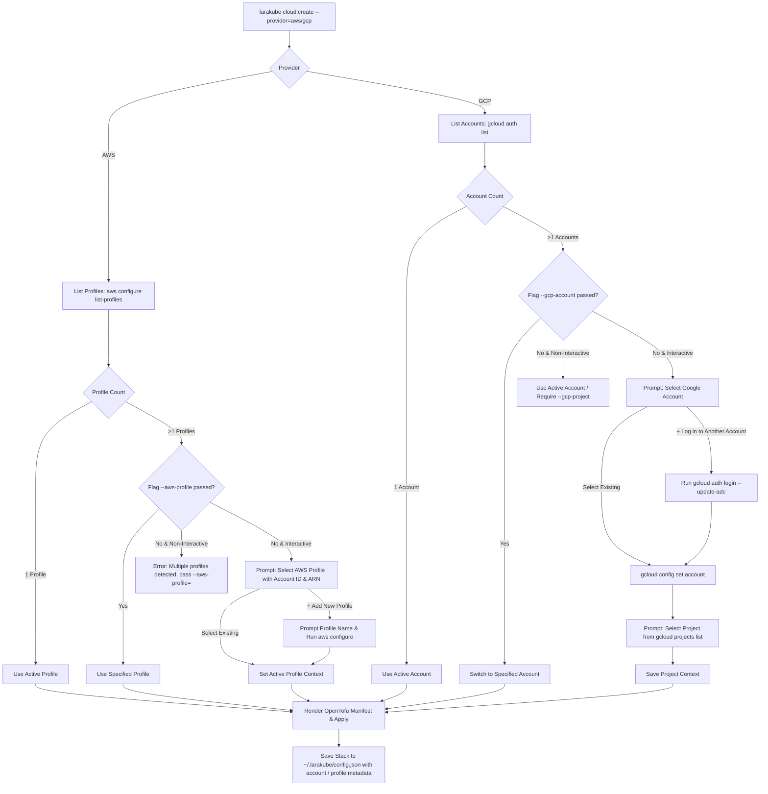

# Implementation Plan: Multi-Account GCP & AWS Support

**Status:** ✅ COMPLETED (All 2,631 tests passing, Pint & PHPStan clean)  
**Target Commands:** `cloud:create`, `cloud:scale`, `cloud:destroy`, `cloud:stacks`  
**Providers:** Google Cloud Platform (GCP), Amazon Web Services (AWS)

---

## 🎯 Executive Summary & Objectives

Developers and cloud operators frequently manage multiple AWS accounts (e.g. personal sandbox, client production, staging) and multiple Google Cloud accounts (personal Google account, Google Workspace / enterprise email).

Currently:
- **GCP**: Supports project selection via `gcloud projects list`, but assumes the currently active `gcloud` authenticated account. If a developer has multiple Google accounts logged into `gcloud`, they cannot easily switch accounts from within LaraKube.
- **AWS**: Supports `--aws-profile` if passed as a flag, but during interactive provisioning automatically adopts whichever credentials answer `aws sts get-caller-identity`, without surfacing other named AWS profiles configured in `~/.aws/credentials` or `~/.aws/config`.
- **Stack Metadata**: `StackData` records `provider`, `kind`, `region`, `ip`, and `context`, but does not record the specific AWS profile or GCP account/project used to mint the stack. When running subsequent commands like `cloud:scale` or `cloud:destroy`, LaraKube relies on whatever environment/profile happens to be active in the current shell.

This feature introduces **first-class multi-account management** for both AWS and GCP:
1. **Auto-Discovery & Interactive Selection**: If multiple profiles/accounts are detected, present an interactive picker with the active one pre-selected and account identity metadata displayed (Account ID, ARN, email). If only one profile/account exists, proceed automatically.
2. **In-Flow Account Onboarding**: Include `+ Add new account / profile` directly in the prompt to allow running `gcloud auth login --update-adc` or `aws configure --profile <name>` on the fly.
3. **Stack Metadata Persistence**: Record the AWS profile or GCP account/project ID directly on `StackData` in `~/.larakube/config.json`.
4. **Credential Context Hydration for Day-2 Ops**: `cloud:scale` and `cloud:destroy` automatically hydrate the exact credentials and environment for the target stack without reprompting or clashing with the shell's active profile.
5. **Strict Non-Interactive Flag Rule**: In `--no-interaction` mode, if multiple accounts exist and no flag (`--aws-profile=` or `--gcp-project=`) is passed, fail fast with a descriptive error.

---

## 📐 Architecture & Flow



---

## 📦 User Experience & Prompt Design

### 1. AWS Multi-Account Flow
```
LARAKUBE LaraKube Cloud Pilot: OpenTofu Provisioner

Which cloud provider?
❯ Amazon Web Services

Which AWS Profile would you like to use?
❯ default  (Account: 123456789012, arn:aws:iam::123456789012:user/admin) [active]
  work     (Account: 987654321098, arn:aws:iam::987654321098:role/DevOps)
  personal (Account: 555666777888, arn:aws:iam::555666777888:user/john)
  + Add new AWS profile
```

### 2. GCP Multi-Account Flow
```
LARAKUBE LaraKube Cloud Pilot: OpenTofu Provisioner

Which cloud provider?
❯ Google Cloud Platform

Which Google Cloud account would you like to use?
❯ john.doe@company.com [active]
  john.personal@gmail.com
  + Log in to another Google account

Google Cloud Project (for john.doe@company.com)
❯ Acme Production (acme-prod-48192)
  Acme Staging (acme-staging-10294)
  + Create a new Google Cloud project
  ✎ Enter Project ID manually
```

---

## 🛠️ Detailed File Changes

### 1. `cli/app/Data/StackData.php` [MODIFY]
- Add properties to `StackData`:
  - `public ?string $account = null` (stores AWS profile name, e.g. `work`, or GCP account email, e.g. `john@company.com`)
  - `public ?string $projectId = null` (stores GCP project ID, e.g. `acme-prod-48192`)
- Update `toArray()` / serialization to maintain backwards compatibility.

### 2. `cli/app/Traits/InteractsWithAws.php` [MODIFY]
- Implement profile discovery:
  - `listAwsProfiles(): array<string, array{account: string, arn: string}>`: parses `aws configure list-profiles` and inspects caller identity for each profile.
- In `ensureAwsCredentials()`:
  - If `--aws-profile=` is passed, use it directly.
  - If running interactively:
    - If multiple profiles exist, prompt using `select()`:
      - Display each profile with its account ID and ARN.
      - Include `__add__` (`+ Add new AWS profile`).
    - If `__add__` is chosen, prompt for profile name and run `aws configure --profile <name>`.
  - In non-interactive mode:
    - If multiple profiles exist and neither `--aws-profile` nor explicit access keys are provided, throw `laraKubeError('Multiple AWS profiles detected (...). Pass --aws-profile= when running non-interactively.')`.
  - Export `AWS_PROFILE` so OpenTofu and CLI tools execute under the selected profile.

### 3. `cli/app/Traits/InteractsWithGcp.php` [MODIFY]
- Add flag support:
  - `{--gcp-account= : Google Cloud account email}`
- Implement account discovery:
  - `listGcpAccounts(): array<string, bool>`: runs `gcloud auth list --format="json(account,status)"`.
- In `ensureGcpCredentials()`:
  - If `--gcp-account=` is passed, switch via `gcloud config set account <email>`.
  - If running interactively:
    - If multiple accounts exist in `gcloud auth list`:
      - Prompt using `select()` to pick the account (or `+ Log in to another Google account`).
      - If adding, run `gcloud auth login --update-adc`.
      - Switch active account: `gcloud config set account <email>`.
  - Proceed to project selection under that account.

### 4. `cli/app/Commands/Cloud/CloudCreateCommand.php` [MODIFY]
- Add `--gcp-account=` to signature:
  - `{--gcp-account= : Google Cloud account email for this run only}`
- In `registerStack()`:
  - Pass the resolved AWS profile or GCP account and project ID into `StackData`.

### 5. `cli/app/Commands/Cloud/CloudScaleCommand.php` [MODIFY]
- Add `--gcp-account=` to signature.
- In `scale()`:
  - Read `account` and `projectId` from `$stack`.
  - Automatically hydrate `State::$transientAwsProfile = $stack->account` (if AWS).
  - Automatically hydrate `State::$transientGcpProject = $stack->projectId` and switch account (if GCP).
  - Perform scaling with guaranteed credential parity.

### 6. `cli/app/Commands/Cloud/CloudDestroyCommand.php` [MODIFY]
- In `destroy()`:
  - Read `account` and `projectId` from `$stack`.
  - Automatically hydrate the exact profile/account used during creation before invoking `tofu destroy`.

---

## 🧪 Verification Plan

### Automated Tests
1. **AWS Multi-Profile Tests** (`tests/Feature/CloudCreateAwsMultiAccountTest.php`):
   - Single profile: auto-selected without prompt.
   - Multiple profiles: interactive prompt displays profile names, account numbers, and ARNs.
   - Multiple profiles under `--no-interaction` without `--aws-profile`: exits with code 1 and descriptive error.
   - Profile persisted to `StackData` on stack creation.
   - `CloudScaleCommand` and `CloudDestroyCommand` respect `StackData::$account`.
2. **GCP Multi-Account Tests** (`tests/Feature/CloudCreateGcpMultiAccountTest.php`):
   - Single account: auto-selected.
   - Multiple accounts: interactive prompt displays accounts and switches via `gcloud config set account`.
   - `--gcp-account=` flag overrides selection.
   - Account and project ID persisted to `StackData`.
3. **Regression Tests**:
   - Run Pint: `./vendor/bin/pint`
   - Run PHPStan: `php -d memory_limit=2G ./vendor/bin/phpstan analyse --no-progress`
   - Full Pest suite: `./vendor/bin/pest`

### Manual Verification
1. User builds CLI binary: `cd cli && ./build`
2. Test AWS profile selection: `larakube cloud:create --provider=aws`
3. Test GCP account switching: `larakube cloud:create --provider=gcp`
