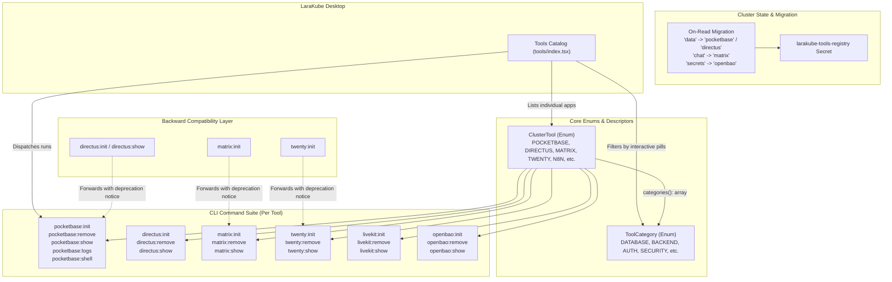

# Architectural & Implementation Plan: Overhaul Tool Categories to Individual Tools

## 1. Goal Description
De-couple all LaraKube Cluster Tools from abstract, rigid categories (`data`, `flow`, `chat`, `crm`, `secrets`, etc.) into first-class individual tool entities (`pocketbase`, `directus`, `n8n`, `matrix`, `twenty`, `openbao`, `kuma`, `vaultwarden`, etc.). 

Categories become **flexible descriptors/tags** (`ToolCategory` enum) rather than execution verbs or identifiers. Each tool has dedicated CLI commands (`pocketbase:init`, `pocketbase:remove`, `pocketbase:show`, `pocketbase:logs`, `pocketbase:shell`, etc.), tailored flags, and clear brand identity.

To protect existing production clusters that have not yet migrated, **all legacy category commands (`data:*`, `chat:*`, `crm:*`, etc.) are retained as backward-compatible forwarding wrappers** with clear deprecation notices until all production workloads have been migrated.

---

## 2. User Decisions & Architectural Alignment
1. **Command Structure**: Dedicated individual tool commands (`<tool>:init`, `<tool>:remove`, `<tool>:show`, etc.) as primary verbs.
2. **Lifecycle Verbs**: Full suite per tool (`*:init`, `*:remove`, `*:show`, `*:logs`, `*:shell`, `*:backup`, `*:restore` where applicable).
3. **Naming Convention**: Short canonical brand names (`pocketbase`, `directus`, `kuma`, `vaultwarden`, `openbao`, `n8n`, `grafana`, `forgejo`, `matrix`, `twenty`, `livekit`, `external-dns`).
4. **Category Descriptors**: Structured `ToolCategory` enum (`DATABASE`, `BACKEND`, `AUTH`, `SECURITY`, `COMMUNICATION`, `OBSERVABILITY`, `PRODUCTIVITY`, `DEVOPS`, `ANALYTICS`, `STORAGE`), allowing tools to define multiple categories.
5. **Production Safety & Backward-Compatible Aliases**: Retain existing category commands (`directus:init`, `matrix:init`, `twenty:init`, etc.) as backward-compatible wrappers that output a gentle deprecation notice and delegate directly to the new individual tool commands (`pocketbase:init`, `matrix:init`, `twenty:init`, etc.).
6. **Multi-Instance Support**: Domain-as-identity (`--domain=blog.example.com` defines instance).
7. **Bundled Stacks**: Branded by primary UI tool (e.g. `grafana:init` provisions the Grafana stack including Prometheus & Loki; `external-dns:init` provisions ExternalDNS).

---

## 3. High-Level Architecture & Entity Diagram



---

## 4. Phase-by-Phase Implementation Plan

### Phase 1: Core Enums & Descriptors (`cli/app/Enums/`)
1. **Create `ToolCategory` Enum (`cli/app/Enums/ToolCategory.php`)**:
   - Cases: `DATABASE`, `BACKEND`, `AUTH`, `SECURITY`, `COMMUNICATION`, `OBSERVABILITY`, `PRODUCTIVITY`, `DEVOPS`, `ANALYTICS`, `STORAGE`.
   - Methods: `label(): string`, `icon(): string`, `color(): string`.
2. **Refactor `ClusterTool` Enum (`cli/app/Enums/ClusterTool.php`)**:
   - Add individual tool cases:
     `POCKETBASE = 'pocketbase'`, `DIRECTUS = 'directus'`, `MATRIX = 'matrix'`, `TWENTY = 'twenty'`, `N8N = 'n8n'`, `WINDMILL = 'windmill'`, `OPENBAO = 'openbao'`, `NETBIRD = 'netbird'`, `ZITADEL = 'zitadel'`, `VAULTWARDEN = 'vaultwarden'`, `KUMA = 'kuma'`, `GRAFANA = 'grafana'`, `FORGEJO = 'forgejo'`, `GITEA = 'gitea'`, `METABASE = 'metabase'`, `GLITCHTIP = 'glitchtip'`, `OCIS = 'ocis'`, `OUTLINE = 'outline'`, `TEABLE = 'teable'`, `NOCODB = 'nocodb'`, `DOCUMENSO = 'documenso'`, `CHATWOOT = 'chatwoot'`, `UMAMI = 'umami'`, `PLAUSIBLE = 'plausible'`, `HEADLAMP = 'headlamp'`, `LIVEKIT = 'livekit'`, `STALWART = 'stalwart'`, `BULWARK = 'bulwark'`, `PLANKA = 'planka'`, `KUTT = 'kutt'`, `PENPOT = 'penpot'`, `RESUME = 'resume'`, `YOPASS = 'yopass'`, `SENDREC = 'sendrec'`, `EXTERNAL_DNS = 'external-dns'`.
   - Retain legacy category cases temporarily as aliases (`DATA = 'data'`, etc.) with `isLegacy(): bool` and `canonicalTool(): self`.
   - Implement `categories(): array<ToolCategory>`.
   - Direct `vendor(): ClusterToolVendor` mapping.

### Phase 2: Registry Auto-Migration (`cli/app/Traits/InteractsWithToolRegistry.php`)
1. **On-Read & Auto-Refresh Migration**:
   - In `getRegisteredTools()`, detect entries where `tool` is a legacy category (`data`, `flow`, `chat`, etc.).
   - Automatically map to its canonical tool slug based on stored engine or brand.
   - Update `larakube-tools-registry` Secret in-place so active workloads and PVCs remain 100% intact.

### Phase 3: Dedicated CLI Commands & Backward-Compatible Wrappers (`cli/app/Commands/`)
1. **Create Dedicated Tool Command Directories**:
   - `PocketBase`: `PocketBaseInitCommand` (`pocketbase:init`), `PocketBaseRemoveCommand`, `PocketBaseShowCommand`, `PocketBaseLogsCommand`, `PocketBaseShellCommand`, `PocketBaseBackupCommand`, `PocketBaseRestoreCommand`.
   - `Directus`: `DirectusInitCommand` (`directus:init`), `DirectusRemoveCommand`, `DirectusShowCommand`, `DirectusLogsCommand`.
   - `Matrix`: `MatrixInitCommand` (`matrix:init`), `MatrixRemoveCommand`, `MatrixShowCommand`, `MatrixLogsCommand`.
   - `Twenty`: `TwentyInitCommand` (`twenty:init`), `TwentyRemoveCommand`, `TwentyShowCommand`, `TwentyLogsCommand`.
   - `LiveKit`: `LiveKitInitCommand` (`livekit:init`), `LiveKitRemoveCommand`, `LiveKitShowCommand`, `LiveKitLogsCommand`.
   - `OpenBao`: `OpenBaoInitCommand` (`openbao:init`), `OpenBaoRemoveCommand`, `OpenBaoShowCommand`, `OpenBaoLogsCommand`.
   - `NetBird`: `NetBirdInitCommand` (`netbird:init`), `NetBirdRemoveCommand`, `NetBirdShowCommand`, `NetBirdLogsCommand`.
   - `Zitadel`: `ZitadelInitCommand` (`zitadel:init`), `ZitadelRemoveCommand`, `ZitadelShowCommand`, `ZitadelLogsCommand`.
   - `Vaultwarden`: `VaultwardenInitCommand` (`vaultwarden:init`), `VaultwardenRemoveCommand`, `VaultwardenShowCommand`, `VaultwardenLogsCommand`.
   - `Kuma`: `KumaInitCommand` (`kuma:init`), `KumaRemoveCommand`, `KumaShowCommand`, `KumaLogsCommand`.
   - `Grafana`: `GrafanaInitCommand` (`grafana:init`), `GrafanaRemoveCommand`, `GrafanaShowCommand`, `GrafanaLogsCommand`.
   - `N8n`: `N8nInitCommand` (`n8n:init`), `N8nRemoveCommand`, `N8nShowCommand`, `N8nLogsCommand`.
   - `Forgejo`: `ForgejoInitCommand` (`forgejo:init`), `ForgejoRemoveCommand`, `ForgejoShowCommand`, `ForgejoLogsCommand`.
   - `Metabase`: `MetabaseInitCommand` (`metabase:init`), `MetabaseRemoveCommand`, `MetabaseShowCommand`, `MetabaseLogsCommand`.
   - `GlitchTip`: `GlitchTipInitCommand` (`glitchtip:init`), `GlitchTipRemoveCommand`, `GlitchTipShowCommand`, `GlitchTipLogsCommand`.
   - `Ocis`: `OcisInitCommand` (`ocis:init`), `OcisRemoveCommand`, `OcisShowCommand`, `OcisLogsCommand`.
   - `Outline`: `OutlineInitCommand` (`outline:init`), `OutlineRemoveCommand`, `OutlineShowCommand`, `OutlineLogsCommand`.
   - `Teable`: `TeableInitCommand` (`teable:init`), `TeableRemoveCommand`, `TeableShowCommand`, `TeableLogsCommand`.
   - `Documenso`: `DocumensoInitCommand` (`documenso:init`), `DocumensoRemoveCommand`, `DocumensoShowCommand`, `DocumensoLogsCommand`.
   - `Chatwoot`: `ChatwootInitCommand` (`chatwoot:init`), `ChatwootRemoveCommand`, `ChatwootShowCommand`, `ChatwootLogsCommand`.
   - `Umami`: `UmamiInitCommand` (`umami:init`), `UmamiRemoveCommand`, `UmamiShowCommand`, `UmamiLogsCommand`.
   - `Headlamp`: `HeadlampInitCommand` (`headlamp:init`), `HeadlampRemoveCommand`, `HeadlampShowCommand`, `HeadlampLogsCommand`.
   - `Stalwart`: `StalwartInitCommand` (`stalwart:init`), `StalwartRemoveCommand`, `StalwartShowCommand`, `StalwartLogsCommand`.
   - `Bulwark`: `BulwarkInitCommand` (`bulwark:init`), `BulwarkRemoveCommand`, `BulwarkShowCommand`, `BulwarkLogsCommand`.
   - `Planka`: `PlankaInitCommand` (`planka:init`), `PlankaRemoveCommand`, `PlankaShowCommand`, `PlankaLogsCommand`.
   - `Kutt`: `KuttInitCommand` (`kutt:init`), `KuttRemoveCommand`, `KuttShowCommand`, `KuttLogsCommand`.
   - `Penpot`: `PenpotInitCommand` (`penpot:init`), `PenpotRemoveCommand`, `PenpotShowCommand`, `PenpotLogsCommand`.
   - `Resume`: `ResumeInitCommand` (`resume:init`), `ResumeRemoveCommand`, `ResumeShowCommand`, `ResumeLogsCommand`.
   - `Yopass`: `YopassInitCommand` (`yopass:init`), `YopassRemoveCommand`, `YopassShowCommand`, `YopassLogsCommand`.
   - `Sendrec`: `SendrecInitCommand` (`sendrec:init`), `SendrecRemoveCommand`, `SendrecShowCommand`, `SendrecLogsCommand`.
   - `ExternalDns`: `ExternalDnsInitCommand` (`external-dns:init`), `ExternalDnsRemoveCommand`, `ExternalDnsShowCommand`, `ExternalDnsLogsCommand`.
2. **Backward-Compatible Wrappers for Old Commands**:
   - Turn `DataInitCommand`, `ChatInitCommand`, `CrmInitCommand`, etc. into backward-compatible wrappers:
     - Output: `[DEPRECATION] 'directus:init' is deprecated. Forwarding to 'pocketbase:init' (or 'directus:init'). Please update your scripts.`
     - Forward options and arguments to the target individual tool command using `Artisan::call(...)`.

### Phase 4: LaraKube Desktop Overhaul (`desktop/`)
1. **Types (`desktop/resources/js/types/larakube.ts`)**:
   - Update `ClusterTool` type to include `categories: string[]`.
   - Update `toolName` to strictly reflect tool product name.
2. **Tool Catalog & Controller**:
   - `ClusterToolController.php`: Update `store` to invoke the specific tool command (`"{$tool}:init"`), passing `--domain` and flags directly.
   - `routes/servers/tools.ts`: Routes remain clean `/servers/{server}/tools/{tool}` where `{tool}` is now `'pocketbase'`, `'directus'`, `'matrix'`, etc.
3. **UI Enhancements (`desktop/resources/js/pages/tools/index.tsx`)**:
   - Multi-category filter pills: Display categories (`All`, `Database`, `Security`, `Communication`, `Observability`, `Productivity`, `DevOps`, `Storage`, `Analytics`).
   - Every tool card displays its authentic brand icon, title, and multiple category descriptor pills.
   - Clicking "Install" for PocketBase opens PocketBase installation; clicking "Install" for Directus opens Directus installation.

### Phase 5: Verification & Testing
1. Proactively run `composer format` and `vendor/bin/pint`.
2. Proactively run `composer analyse` and `vendor/bin/phpstan analyse`.
3. Proactively run `composer test` and `php artisan test`.
4. Run `npm run types:check` and `npm run build` in `desktop`.

---

## 6. Execution Status & Completion Report

- [x] **Phase 1: Core Enums & Descriptors (`cli/app/Enums/`)**
  - Created `ToolCategory` enum with 10 categories, icons, colors, labels.
  - Refactored `ClusterTool` enum with 35 canonical individual tool cases + 29 backward-compatible legacy aliases.
  - Integrated `isLegacy()`, `canonicalTool()`, `legacyCategoryPrefix()`, and `categories()`.

- [x] **Phase 2: Registry Auto-Migration & Bidirectional Resolution (`cli/app/Services/ToolRegistry.php`)**
  - Upgraded `ToolRegistry` to bidirectionally match both canonical and legacy slugs without unexpected writes on read.
  - Handled on-the-fly upgrade of legacy slugs during registration.

- [x] **Phase 3: Dedicated CLI Commands & Backward-Compatible Wrappers (`cli/app/Commands/`)**
  - Created dedicated command suites for all 35 canonical tools (`pocketbase:*`, `directus:*`, `matrix:*`, `n8n:*`, `windmill:*`, `openbao:*`, `netbird:*`, `zitadel:*`, `vaultwarden:*`, `kuma:*`, `grafana:*`, `forgejo:*`, `gitea:*`, etc.).
  - Wrapped all legacy category commands (`data:*`, `chat:*`, `crm:*`, etc.) with deprecation notices and seamless forwarding.
  - Updated traits (`PicksRegisteredTool`, `InteractsWithToolRegistry`, `ResolvesMeetWireTarget`, `DataWireCommand`, `VpnUnwireCommand`, `SecretsWireCommand`).

- [x] **Phase 4: LaraKube Desktop Overhaul (`desktop/`)**
  - Updated TypeScript definitions with `categories: string[]`.
  - Replaced legacy category verbs with canonical tool commands in controllers and UI.
  - Modernized `tools/index.tsx` with dynamic category pills, authentic tool logos, and multi-instance readiness.
  - Added new desktop logo (`desktop/logo-v2.png`) throughout the app.

- [x] **Phase 5: Component Isolation, Registry Hygiene & Deduplication (`cli/` & `desktop/`)**
  - **Tool Name Component Stripping Bug Fix**: Fixed `withoutCategory()` in `ClusterTool.php` which was stripping tool name prefixes (e.g. `netbird-` from `netbird-client`), making `forInstancedDeployment()` incorrectly resolve `netbird-client-vpn-...` as an instance named `client-vpn-...`.
  - **Convention Discovery Filter**: Hardened `discoverConventionTools()` in `ToolListCommand.php`:
    1. Restricted discovery strictly to `ClusterToolComponentRole::PRIMARY` components, preventing secondary subcomponents (`worker`, `client`, `signal`, `relay`, `dashboard`) from being registered as separate tool instances.
    2. Required valid Ingress host derivation for HTTP tools, skipping ad-hoc cluster workloads (e.g. `grafana-matrix-forwarder`).
  - **Automatic Registry Pruning**: Added `pruneBogusRegistryEntries()` in `ToolListCommand.php` to clean up leaked subcomponent instances from `larakube-tools-registry` on cluster scans.
  - **Desktop Defensive Deduplication**: Updated `installedAll` memoization in `desktop/resources/js/pages/tools/index.tsx` to filter subcomponent leaks and enforce single-instance uniqueness for tools not marked in `MULTI_INSTANCE_TOOLS`.
  - **Forgejo Canonicalization**: Cleaned up spurious `GITEA` enum case and commands, keeping Forgejo as the single source of truth for git forge tooling.

- [x] **Phase 6: Verification & Quality Gates**
  - **CLI Tests**: 2,767 Pest tests (2,763 passed, 4 skipped, 0 failed, 12,351 assertions) — 100% GREEN.
  - **CLI Static Analysis**: `composer analyse` (PHPStan) — 0 errors.
  - **CLI Formatting**: `composer format` (Rector & Pint) — clean.
  - **Desktop Tests**: 108 Pest tests, 706 assertions — 100% GREEN.
  - **Desktop Static Analysis**: PHPStan & Pint — 0 errors.
  - **Desktop Frontend**: `npm run types:check` (tsc) & `npm run build` — 100% clean.

---

## 7. Next User Action
Per project guidelines, AI agents are strictly forbidden from executing `./build`. The user should execute:
```bash
./build
```
to compile the final production PHAR binary.

