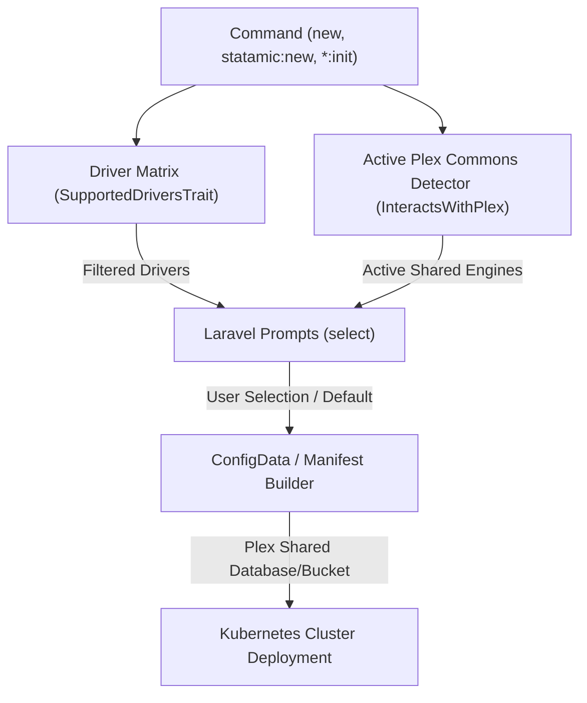

# Plan: Plex Commons Active Detection & Driver Compatibility Matrix

**Status:** Proposed Active Plan
**Created:** 2026-08-04
**Target Version:** LaraKube CLI v1.2.0

---

## 🎯 Objective

Re-engineer the detection and reuse of **Plex Commons** shared services (PostgreSQL, MySQL/MariaDB, SeaweedFS S3, Redis/Valkey, Meilisearch) across LaraKube application scaffolding (`larakube new`, `statamic:new`, `init`) and cluster tools (`*:init`, `companion:add`).

---

## 🏛 Architecture & Design

---

## 📋 Implementation Checklist

- [ ] Create `cli/app/Traits/SupportedDriversTrait.php`
- [ ] Add `supportedDatabaseDrivers()`, `supportedCacheDrivers()`, `supportedStorageDrivers()`, `supportedSearchDrivers()` to `cli/app/Enums/AppFramework.php`
- [ ] Add `supportedDatabaseDrivers()`, `supportedCacheDrivers()`, `supportedStorageDrivers()`, `supportedSearchDrivers()` to `cli/app/Enums/ClusterTool.php`
- [ ] Update `cli/app/Traits/GathersInfrastructureConfig.php` to use `SupportedDriversTrait` and pre-select active Plex engines
- [ ] Update `cli/app/Commands/Statamic/StatamicNewCommand.php` to filter and pre-select Plex drivers
- [ ] Update `cli/app/Commands/NewCommand.php` and `cli/app/Commands/InitCommand.php`
- [ ] Create Pest feature test suite (`cli/tests/Feature/PlexDriverMatrixTest.php`)
- [ ] Run Pest tests & static analysis (`./php vendor/bin/phpstan`)

---

## ✅ Definition of Done

- `AppFramework` and `ClusterTool` declare exact driver compatibility matrices.
- Commands (`new`, `statamic:new`, `init`, `*:init`) detect active Plex Commons services and pre-select them as prompt defaults.
- Prompts only display drivers compatible with the selected framework/tool.
- Pest unit tests and PHPStan pass with 0 errors.
