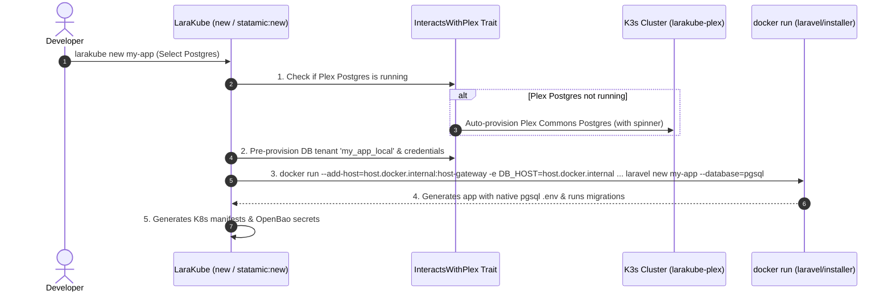

# Plan: Plex Commons Default Local Dev Setup & Auto-Provisioning

**Status:** Proposed Active Plan
**Created:** 2026-08-05
**Target Version:** LaraKube CLI v1.2.0

---

## 🎯 Objective

Establish **Plex Commons (`larakube-plex`)** as the default shared development setup across all LaraKube application scaffolding commands (`new`, `statamic:new`, `init`, `add`), reducing local RAM consumption by reusing shared PostgreSQL, MySQL, Redis, and S3 infrastructure.

---

## 🏛 Architecture & Execution Flow

---

## 📋 Implementation Checklist

- [ ] Update `cli/app/Traits/GathersInfrastructureConfig.php` to default to Plex Commons engines and auto-trigger Plex bootstrap when missing.
- [ ] Add `ensurePlexProvisionedForApp()` helper to `cli/app/Traits/InteractsWithPlex.php`.
- [ ] Update `runLaravelNew()` in `cli/app/Commands/NewCommand.php` to inject DB env vars (`DB_HOST=host.docker.internal`, `DB_PORT`, `DB_DATABASE`, `DB_USERNAME`, `DB_PASSWORD`), `--add-host=host.docker.internal:host-gateway`, and `--database=pgsql`.
- [ ] Update `cli/app/Commands/Statamic/StatamicNewCommand.php`.
- [ ] Create Pest feature test suite (`cli/tests/Feature/PlexAutoProvisioningTest.php`).
- [ ] Run Pest unit tests & static analysis (`./php vendor/bin/phpstan`).

---

## ✅ Definition of Done

- `larakube new` and `statamic:new` auto-provision missing Plex Commons services with an informational spinner.
- Database tenants are pre-provisioned in Plex Postgres/MySQL before `laravel new` runs.
- `laravel new` receives `--database=pgsql` (or `mysql`) and DB env vars, writing a clean `.env` and executing initial migrations on step 1.
- All Pest tests and PHPStan pass with 0 errors.
