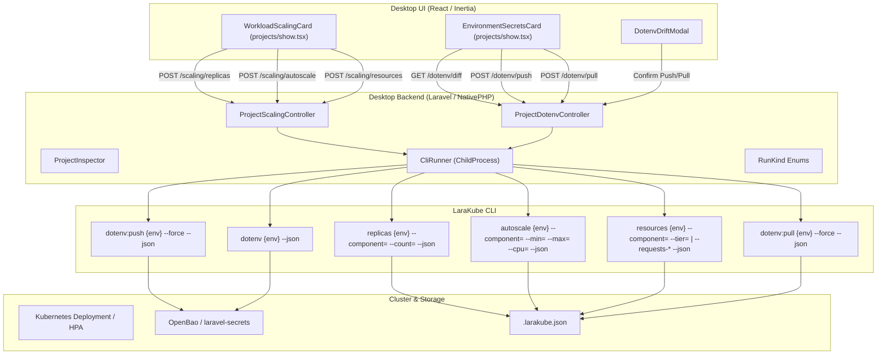

# Project Operations & Scaling: CLI Automation & Desktop UI Plan

## Executive Summary
LaraKube provides powerful operational commands for managing workload scaling, compute resource limits, and environment secret synchronization:
- `replicas`: Fixed pod replica count per component (`web`, `worker`, `reverb`, or default).
- `autoscale`: HorizontalPodAutoscaler (HPA min/max replicas, CPU utilization target) per component.
- `resources`: Compute requests and limits (CPU and Memory) per component.
- `dotenv`: Real-time drift detection comparing local `.env.<env>` against cluster `ConfigMap` and `Secret`.
- `dotenv:push`: Direct-from-workstation secret upload to OpenBao / `laravel-secrets` (bypassing CI/CD).
- `dotenv:pull`: Secure retrieval of cluster secrets into local `.env.<env>` for developer onboarding.
- `dotenv:audit`: Inventory of all environment variable keys deployed to a cluster namespace.

This plan details the full implementation of both features across the CLI and Desktop UI, aligned via the interactive `/grill-me` session.

---

## Key Design Decisions (Settled via `/grill-me`)

| Decision Area | Alignment Outcome | Rationale |
| :--- | :--- | :--- |
| **1. UI Positioning** | **Stacked in Main Column**: "Workload Scaling & Pods" sits directly below Telemetry, and "Environment Secrets" sits directly below Backing Services. | Keeps operational controls co-located with their relevant environment telemetry and backing services. |
| **2. Secret Sync & Safety** | **Interactive Masked Drift Modal**: Compares local `.env.<env>` with cluster secrets, shows drift status (Match, Drifted, Missing), masks values (`••••••••`) with an unmask toggle, and requires confirmation before push/pull. | Prevents accidental overwrites of production secrets while safeguarding sensitive credentials from casual screen viewing. |
| **3. Autoscaling vs Replicas UX** | **Segmented Component-Level Switch**: Each component row (`Web`, `Workers`, `Reverb`) toggles between "Fixed Replicas" (stepper `[-] N [+]`) and "Autoscale HPA" (min/max range & target CPU %). | Gives granular control; developers can autoscale HTTP web pods while keeping queue workers or WebSockets on fixed replica counts. |
| **4. Resource Sizing UX** | **Preset Tiers + Custom Override**: Quick tiers (Eco: 128MB / 0.1 CPU, Standard: 512MB / 0.25 CPU, Pro: 2GB / 1.0 CPU) with a Custom mode for fine-grained millicores and megabytes. | Eliminates Kubernetes YAML unit confusion for standard setups while preserving power-user flexibility. |

---

## Architectural Workflow & Data Flow



---

## Phase 1: CLI Non-Interactive Automation & JSON Mode (`cli/`)

### 1. `ReplicasCommand` (`cli/app/Commands/ReplicasCommand.php`)
- **Signature**:
  ```php
  protected $signature = 'replicas
      {environment? : The environment to configure}
      {--component= : Target component (default, web, worker, reverb)}
      {--count= : Replica count (integer >= 0)}
      {--reset : Reset component replica count to default}
      {--json : Emit machine-readable JSON output}';
  ```
- **Execution**:
  - Updates `.larakube.json` via `$config->setReplicas($env, $component, $count)`.
  - When `--json` is set, emits:
    ```json
    { "success": true, "environment": "production", "component": "web", "count": 3 }
    ```

### 2. `AutoscaleCommand` (`cli/app/Commands/AutoscaleCommand.php`)
- **Signature**:
  ```php
  protected $signature = 'autoscale
      {environment? : The environment to configure}
      {--component= : Target component (web, worker, reverb)}
      {--min= : Minimum replicas (integer >= 1)}
      {--max= : Maximum replicas (integer >= min)}
      {--cpu= : Target CPU utilization percentage (default: 70)}
      {--disable : Disable HPA and revert to static replicas}
      {--json : Emit machine-readable JSON output}';
  ```
- **Execution**:
  - Updates `.larakube.json` via `$config->setAutoscale($env, $component, $min, $max, $cpu)`.
  - Emits JSON state when `--json` flag is provided.

### 3. `ResourcesCommand` (`cli/app/Commands/ResourcesCommand.php`)
- **Signature**:
  ```php
  protected $signature = 'resources
      {environment? : The environment to configure}
      {--component= : Target component (default, web, worker, reverb)}
      {--tier= : Quick preset tier (eco, standard, pro)}
      {--requests-cpu= : CPU request (e.g. 100m, 500m, 1)}
      {--requests-memory= : Memory request (e.g. 128Mi, 512Mi, 1Gi)}
      {--limits-cpu= : CPU limit (e.g. 500m, 1, 2)}
      {--limits-memory= : Memory limit (e.g. 512Mi, 1Gi, 2Gi)}
      {--reset : Reset to default}
      {--json : Emit machine-readable JSON output}';
  ```
- **Tiers Definition**:
  - `eco`: Requests 100m / 128Mi, Limits 250m / 256Mi.
  - `standard`: Requests 250m / 512Mi, Limits 500m / 1Gi.
  - `pro`: Requests 1000m / 2Gi, Limits 2000m / 4Gi.

### 4. `Dotenv` Commands (`cli/app/Commands/Dotenv*`)
- **`dotenv` (Drift Diff)**:
  - Add `{--json}` emitting structured drift inspection:
    ```json
    {
      "environment": "production",
      "inSync": false,
      "drift": [
        { "key": "APP_KEY", "status": "match", "isSecret": true },
        { "key": "STRIPE_SECRET", "status": "drifted", "isSecret": true, "local": "whsec_...", "cluster": "whsec_old..." },
        { "key": "NEW_FLAG", "status": "missing_cluster", "isSecret": false, "local": "true", "cluster": null },
        { "key": "OLD_TOKEN", "status": "missing_local", "isSecret": true, "local": null, "cluster": "tok_..." }
      ]
    }
    ```
- **`dotenv:push`**:
  - Add `{--force : Skip prompt}` and `{--json}`.
  - Pushes `.env.<env>` to OpenBao / `laravel-secrets`.
- **`dotenv:pull`**:
  - Add `{--force : Skip prompt}` and `{--json}`.
  - Pulls cluster secrets into local `.env.<env>`.

---

## Phase 2: Desktop Backend & Inspection (`desktop/`)

### 1. `RunKind` Enum (`desktop/app/Enums/RunKind.php`)
Register the new operational verbs:
```php
case ConfigureReplicas = 'configure-replicas';
case ConfigureAutoscale = 'configure-autoscale';
case ConfigureResources = 'configure-resources';
case DotenvPush = 'dotenv-push';
case DotenvPull = 'dotenv-pull';
```

### 2. `ProjectInspector` (`desktop/app/Services/LaraKube/ProjectInspector.php`)
Expose scaling configuration and detected scalable components:
- Detect components from blueprint and framework (e.g., `web`, `worker`, `reverb`).
- Read `$blueprint['environments'][$name]['replicas']`.
- Read `$blueprint['environments'][$name]['autoscale']`.
- Read `$blueprint['environments'][$name]['resources']`.

### 3. Routes & Controllers
Add routes in `desktop/routes/web.php`:
```php
Route::post('/projects/{project}/scaling/replicas', [ProjectScalingController::class, 'setReplicas'])->name('projects.scaling.replicas');
Route::post('/projects/{project}/scaling/autoscale', [ProjectScalingController::class, 'setAutoscale'])->name('projects.scaling.autoscale');
Route::post('/projects/{project}/scaling/resources', [ProjectScalingController::class, 'setResources'])->name('projects.scaling.resources');

Route::get('/projects/{project}/dotenv/diff', [ProjectDotenvController::class, 'diff'])->name('projects.dotenv.diff');
Route::post('/projects/{project}/dotenv/push', [ProjectDotenvController::class, 'push'])->name('projects.dotenv.push');
Route::post('/projects/{project}/dotenv/pull', [ProjectDotenvController::class, 'pull'])->name('projects.dotenv.pull');
```

---

## Phase 3: Desktop UI Components (`desktop/resources/js/pages/projects/`)

### 1. Workload Scaling Card (`WorkloadScalingCard`)
Positioned on `projects/show.tsx` directly beneath `AppPerformanceMetricsCard`:
- **Component Rows**:
  - `Web (Octane/FrankenPHP)`
  - `Queue Workers`
  - `Reverb WebSockets` (if detected)
- **Controls per Component**:
  - Toggle: `[ Fixed Count | Autoscale (HPA) ]`.
  - **Fixed Mode**: Stepper `[-]  2  [+]` with debounce submit to `projects.scaling.replicas`.
  - **Autoscale Mode**:
    - Min Replicas (`1..10`) & Max Replicas (`1..30`).
    - Target CPU utilization percentage (default `70%`).
- **Compute Sizing Button**:
  - Displays active tier badge (e.g. `Standard · 512MB / 0.25 CPU`).
  - Opens modal offering quick preset cards (`Eco`, `Standard`, `Pro`) or custom numeric inputs.

### 2. Environment Secrets Card (`EnvironmentSecretsCard`)
Positioned on `projects/show.tsx` directly beneath `EnvironmentBackingServicesCard`:
- **Card Header**:
  - Title: `Environment Secrets · <ENV>`.
  - Status badge: `Synced (All keys match)` | `Drift Detected (3 keys differed)`.
- **Action Buttons**:
  - `<Button variant="primary"><Upload className="size-3.5" /> Push to Cluster</Button>`
  - `<Button variant="secondary"><Download className="size-3.5" /> Pull from Cluster</Button>`
  - `<Button variant="secondary"><FileDiff className="size-3.5" /> Compare Drift</Button>`
- **Interactive Drift Modal (`DotenvDriftModal`)**:
  - Lists variables categorized into:
    - **Drifted**: Value differs between local and cluster.
    - **Missing on Cluster**: Local `.env` has key not yet in cluster.
    - **Missing Locally**: Cluster secret has key not in local `.env`.
    - **Matching**: In sync.
  - Secret values masked with `••••••••` by default, with an individual eye toggle (`Eye` / `EyeOff`) or global "Reveal All" toggle.
  - Confirmation button: `<Button variant="primary"><Check className="size-3.5" /> Confirm & Push</Button>`.

---

## Phase 4: Quality & Testing Verification

1. **CLI Unit & Feature Tests (`cli/tests/Feature/`)**:
   - `WorkloadScalingCommandsTest`: Validates `--component`, `--count`, `--reset`, `--min`, `--max`, `--cpu`, `--disable`, `--tier`, and `--json`.
   - `DotenvCommandTest`: Validates structured drift JSON output and `--json` mode.
   - Result: 3,115 tests passed with 16,189 assertions in CLI test suite.
2. **Desktop Feature Tests (`desktop/tests/Feature/`)**:
   - `ProjectsTest`: Tests scaling endpoints (`replicas`, `autoscale`, `resources`), dotenv endpoints (`status`, `push`, `pull`), and `ChildProcess` dispatch.
   - Result: 378 tests passed with 2,177 assertions in Desktop test suite.
3. **Quality Gates & Commits**:
   - CLI Lint & Types: `composer format` and `composer analyse` (PHPStan) passed with 0 errors.
   - Desktop Lint & Types: `vp check`, `tsc --noEmit`, Pint, and PHPStan passed with 0 errors.
   - CLI Commit: `df047695` (`feat(cli): add non-interactive flags and machine-readable json output for scaling and dotenv commands`)
   - Desktop Commit: `07f512b` (`feat(desktop): add workload scaling controls and environment secrets drift sync`)
   - Mandatory Rule: Instruct user to run `./build` (AI agents strictly forbidden from running `./build`).

