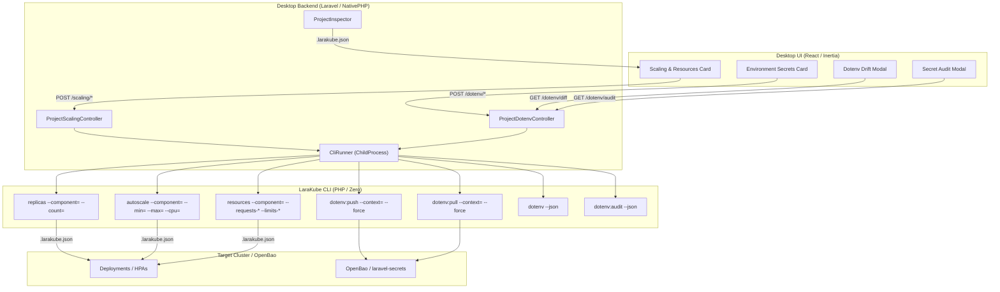

# Project Operations & Scaling: CLI Automation & Desktop UI Plan

## Executive Summary
LaraKube provides powerful operational commands for managing workload scaling, compute resource limits, and environment secret synchronization:
- `replicas`: Fixed pod replica count per component (`web`, `worker`, `reverb`, or default).
- `autoscale`: HorizontalPodAutoscaler (HPA min/max replicas, CPU utilization target) per component.
- `resources`: Compute requests and limits (CPU and Memory) per component.
- `dotenv`: Real-time drift detection comparing local `.env.<env>` against cluster `ConfigMap` and `Secret`.
- `dotenv:push`: Direct-from-workstation secret upload to OpenBao / `laravel-secrets` (bypassing CI/CD).
- `dotenv:pull`: Secure retrieval of cluster secrets into local `.env.<env>` for developer onboarding.
- `dotenv:audit`: Inventory of all environment variable keys deployed to a cluster namespace.

Currently, these commands only offer interactive terminal prompts and lack Desktop UI integration. This plan defines the end-to-end implementation to:
1. Equip CLI commands with non-interactive flags and machine-readable `--json` output.
2. Build Desktop backend controllers, `RunKind` orchestration, and project inspection helpers.
3. Design and integrate intuitive, visual UI cards in LaraKube Desktop (`projects/show.tsx` and `devboxes/project.tsx`).

---

## Architectural Workflow & Data Flow



---

## Phase 1: CLI Non-Interactive Automation & JSON Mode (`cli/`)

### 1.1 `ReplicasCommand` (`cli/app/Commands/ReplicasCommand.php`)
- **Current Signature**: `replicas {environment?}`
- **New Signature**:
  ```php
  protected $signature = 'replicas
      {environment? : The environment to configure}
      {--component= : Target component (default, web, worker, reverb)}
      {--count= : Replica count (integer >= 0)}
      {--reset : Reset to strategy default or inherit from default}
      {--json : Emit machine-readable JSON result}';
  ```
- **Behavior**:
  - When `--component` and (`--count` or `--reset`) are provided, skip interactive prompts.
  - Updates `.larakube.json` via `$config->setReplicas($env, $component, $count)` and saves.
  - In `--json` mode, emits:
    ```json
    {
      "success": true,
      "environment": "production",
      "component": "web",
      "replicas": 3,
      "effective": { "default": 2, "web": 3, "worker": 2 }
    }
    ```

### 1.2 `AutoscaleCommand` (`cli/app/Commands/AutoscaleCommand.php`)
- **Current Signature**: `autoscale {environment?}`
- **New Signature**:
  ```php
  protected $signature = 'autoscale
      {environment? : The environment to configure}
      {--component= : Target component (web, worker, reverb)}
      {--min= : Minimum replica count (integer >= 1)}
      {--max= : Maximum replica count (integer >= min)}
      {--cpu= : Target CPU utilization percentage (default: 70)}
      {--disable : Disable HPA and fall back to static replicas}
      {--json : Emit machine-readable JSON result}';
  ```
- **Behavior**:
  - Validates that target environment is a cloud environment (`$config->getCloudEnvironments()`).
  - Sets HPA parameters or removes them when `--disable` is passed.
  - In `--json` mode, emits updated autoscale state.

### 1.3 `ResourcesCommand` (`cli/app/Commands/ResourcesCommand.php`)
- **Current Signature**: `resources {environment?}`
- **New Signature**:
  ```php
  protected $signature = 'resources
      {environment? : The environment to configure}
      {--component= : Target component (default, web, worker, reverb)}
      {--requests-cpu= : CPU request (e.g. 100m, 500m, 1)}
      {--requests-memory= : Memory request (e.g. 128Mi, 512Mi, 1Gi)}
      {--limits-cpu= : CPU limit (e.g. 500m, 1, 2)}
      {--limits-memory= : Memory limit (e.g. 512Mi, 1Gi, 2Gi)}
      {--reset : Reset component resources to inherit from default}
      {--json : Emit machine-readable JSON result}';
  ```
- **Behavior**:
  - Non-interactive parsing of CPU/RAM values.
  - Saves to `.larakube.json` via `$config->setResources(...)`.

### 1.4 `Dotenv` Commands (`cli/app/Commands/Dotenv*`)
- **`dotenv:push`**:
  - Add `{--force : Overwrite without confirmation}`, `{--json : Emit status}`.
  - Syncs secrets directly to OpenBao and/or creates `laravel-secrets`.
- **`dotenv:pull`**:
  - Add `{--force : Overwrite local file without prompt}`, `{--json : Emit status}`.
  - Retrieves secrets from OpenBao / `laravel-secrets` and updates local `.env.<env>`.
- **`dotenv` (Drift Diff)**:
  - Add `{--json : Emit structured drift output}`:
    ```json
    {
      "environment": "production",
      "namespace": "acme-production",
      "inSync": false,
      "drift": [
        { "key": "APP_KEY", "status": "match", "isSecret": true },
        { "key": "STRIPE_SECRET", "status": "drifted", "isSecret": true },
        { "key": "NEW_FEATURE_FLAG", "status": "missing_on_cluster", "isSecret": false }
      ]
    }
    ```
- **`dotenv:audit`**:
  - Add `{--json : Emit JSON list of deployed keys}`.

---

## Phase 2: Desktop Backend & Inspection (`desktop/`)

### 2.1 Augment `ProjectInspector` (`desktop/app/Services/LaraKube/ProjectInspector.php`)
Add scaling and resource metadata to the inspected project object:
```php
'replicas' => $envConfig['replicas'] ?? [],
'autoscale' => $envConfig['autoscale'] ?? [],
'resources' => $envConfig['resources'] ?? [],
'components' => $this->detectScalableComponents($blueprint),
```

### 2.2 Register New `RunKind` Cases (`desktop/app/Enums/RunKind.php`)
```php
case ConfigureReplicas = 'configure-replicas';
case ConfigureAutoscale = 'configure-autoscale';
case ConfigureResources = 'configure-resources';
case DotenvPush = 'dotenv-push';
case DotenvPull = 'dotenv-pull';
case DotenvAudit = 'dotenv-audit';
```

### 2.3 Implement Desktop Controllers & Routes
Create two dedicated controllers:
1. **`ProjectScalingController`**:
   - `POST /projects/{project}/scaling/replicas`: triggers `replicas` command via `CliRunner`.
   - `POST /projects/{project}/scaling/autoscale`: triggers `autoscale` command via `CliRunner`.
   - `POST /projects/{project}/scaling/resources`: triggers `resources` command via `CliRunner`.
2. **`ProjectDotenvController`**:
   - `POST /projects/{project}/dotenv/push`: runs `dotenv:push --force`.
   - `POST /projects/{project}/dotenv/pull`: runs `dotenv:pull --force`.
   - `GET /projects/{project}/dotenv/diff`: runs `dotenv --json` and returns diff items.
   - `GET /projects/{project}/dotenv/audit`: runs `dotenv:audit --json` and returns inventory.

---

## Phase 3: Desktop UI Components (`desktop/resources/js/pages/projects/`)

### 3.1 Scaling & Workload Controls (`scaling-card.tsx`)
- Placed on the main environment column in `projects/show.tsx` (under `CloudEnvironmentOverviewCard`).
- Features:
  - **Component Selector / Table**: Shows detected components (`Web (Octane/FrankenPHP)`, `Queue Workers`, `Reverb WebSockets`).
  - **Scaling Mode Switch**:
    - **Fixed Replicas**: Visual stepper `[-] [ 3 ] [+]` with direct input.
    - **Autoscaling (HPA)**: Toggle switch enabling Min/Max sliders (e.g. `2 - 8 pods`) and Target CPU % slider (default 70%).
  - **Compute Resources Accordion**:
    - Expandable CPU & Memory configurator.
    - Presets: "Eco (128MB / 100m)", "Standard (512MB / 250m)", "Performance (2GB / 1000m)", and "Custom".
    - Buttons with Lucide icons: `Save`, `RotateCcw` (Reset to default).

### 3.2 Environment Secrets Sync Card (`dotenv-card.tsx`)
- Placed alongside Backing Services in `projects/show.tsx`.
- Visual Elements:
  - **Sync Indicator**: Green badge ("Synced with Cluster"), Amber ("Local Drift Detected"), or Gray ("Not Pushed").
  - **Action Toolbar** (Strict Lucide icon standard):
    - `<Button><Upload className="size-3.5" /> Push to Cluster</Button>`: Uploads local secrets with a confirmation modal explaining encryption in OpenBao.
    - `<Button variant="secondary"><Download className="size-3.5" /> Pull from Cluster</Button>`: Safely updates local `.env.<env>`.
    - `<Button variant="secondary"><FileDiff className="size-3.5" /> Compare Drift</Button>`: Opens modal showing side-by-side key drift.
    - `<Button variant="secondary"><ShieldCheck className="size-3.5" /> Audit Live Keys</Button>`: Lists all secret keys present on the cluster without values.

---

## Phase 4: DevBox Parity (`desktop/resources/js/pages/devboxes/project.tsx`)
Ensure projects running inside remote Dev Boxes also support the same Scaling and Secrets actions through `DevBoxShell` execution.

---

## Testing & Quality Assurance
1. **CLI Tests (`cli/tests/Feature/`)**:
   - `ReplicasCommandTest`: Test `--component`, `--count`, `--reset`, and `--json`.
   - `AutoscaleCommandTest`: Test `--min`, `--max`, `--cpu`, `--disable`, and cloud environment restriction.
   - `ResourcesCommandTest`: Test CPU/Memory options and validation.
   - `DotenvCommandTest`: Test `--json` drift reporting, `dotenv:push --force`, and `dotenv:pull --force`.
2. **Desktop Tests (`desktop/tests/Feature/`)**:
   - `ProjectScalingTest`: Test POST routes starting runs with exact CLI arguments.
   - `ProjectDotenvTest`: Test push, pull, diff, and audit runs and JSON endpoints.
3. **Formatters & Analysis**:
   - Run `composer format`, `composer analyse`, and `composer test` in both `cli/` and `desktop/`.
   - Run `npm run build` in `desktop/`.
