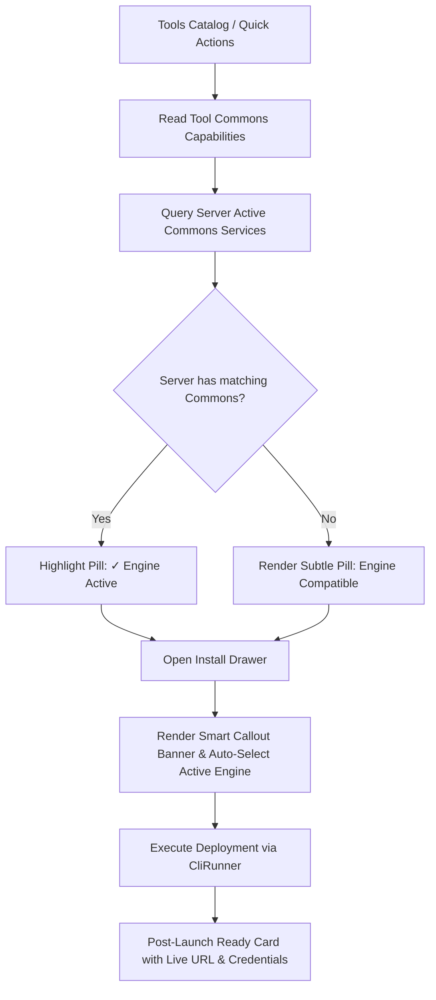

# Implementation Plan: Quick Actions & Standardized Plex Commons Compatibility for Tools

## Goal Description
1. **Quick Actions & 1-Click App Onboarding**:
   Enable zero-friction 1-Click deployments of featured companion applications (**PocketBase**, **n8n**, **WordPress**, and **Uptime Kuma**) from the Desktop Dashboard. When starting from scratch, the **Smart Bundle** automatically coordinates cloud server provisioning, wildcard/Cloudflare SSL, app deployment, and auto-generates secure admin credentials.
2. **Standardized Plex Commons Capability Matrix Across ALL Tools**:
   Establish a fleet-wide standard where every companion tool declares its compatibility with Plex Commons services (Database, Redis/Cache, S3 Storage, OIDC Auth, and SMTP Mail).
3. **Active Commons Pills & Smart Auto-Selection**:
   - On the Tools page, display visual pills for each tool's Commons compatibility.
   - If the active server currently runs that Commons service (e.g. Plex MySQL, Postgres, or Redis), **highlight the pill** (`✓ MySQL Active`, `✓ Redis Active`).
   - In the installation drawer, display a smart callout: *"💡 Active Commons detected: server runs MySQL & Redis. Leasing shared tenant with 0 extra containers."* and auto-select the shared engine by default.

---

## User Review Required
> [!IMPORTANT]
> **Full Commons Stack Compatibility Standard**:
> Every tool in LaraKube will declare its supported Commons backends:
> - **Databases**: `postgresql`, `mysql`, `sqlite`
> - **Cache / Queue**: `redis` (Valkey)
> - **Object Storage**: `s3` (MinIO)
> - **SSO / Auth**: `oidc` (Zitadel)
> - **Mail**: `smtp` (Stalwart)
> When a server runs any of these Commons services, matching tools automatically highlight those capabilities and pre-select shared leasing.

> [!NOTE]
> **WordPress Dual Identity**:
> - **1-Click WordPress App** (Quick Actions / Tools): Self-contained ServerSideUp PHP pod supporting **SQLite (Default, 0 extra RAM)**, **Plex Commons MySQL/MariaDB**, or **Dedicated MariaDB**.
> - **Codebase WordPress Project** (Projects): Full 12-factor Bedrock with Composer, Git repo, and CI/CD pipelines (`AppFramework::WORDPRESS`).

---

## Architecture Flow

---

## Proposed Changes

### 1. CLI: Commons Capabilities Standard on `ClusterTool`

#### [MODIFY] `cli/app/Enums/ClusterTool.php`
- Add `public function commonsCapabilities(?string $engine = null): array` declaring:
  - `databases`: list of supported DB engines (e.g. WordPress: `['sqlite', 'mysql', 'mariadb']`, PocketBase: `['sqlite']`, n8n: `['postgresql', 'sqlite']`, Forgejo: `['postgresql', 'mysql', 'sqlite']`, Directus: `['postgresql', 'mysql', 'sqlite']`, Twenty: `['postgresql']`, Vaultwarden: `['postgresql', 'sqlite', 'mysql']`).
  - `cache`: e.g. `['redis']` for n8n, Forgejo, Directus, Penpot, Outline, Chatwoot, GlitchTip.
  - `storage`: e.g. `['s3']` for PocketBase, n8n, WordPress, Forgejo, Directus, Vaultwarden, Documenso, etc.
  - `auth`: e.g. `['oidc']` for Zitadel-enabled tools.
  - `mail`: e.g. `['smtp']` for Stalwart-enabled tools.
- Include capabilities in `tool:list --json` output.

#### [NEW] `cli/resources/views/k8s/data/wordpress.blade.php`
- Kubernetes manifest template for 1-Click WordPress:
  - Support for SQLite drop-in (default) and MySQL/MariaDB (Plex Commons or dedicated).
  - PVC for `/var/www/html/wp-content`.
  - ConfigMap for SQLite installer script.
  - Ingress with Traefik and cert-manager SSL.

---

### 2. Desktop Backend: Active Commons Detection & Quick Actions

#### [MODIFY] `desktop/app/Http/Controllers/ClusterToolController.php`
- In `index()`:
  - Call `ClusterStatus::plex($context)` to resolve active Commons services on the server (`mysql`, `postgresql`, `redis`, `s3`, `smtp`, `oidc`).
  - Pass `activeCommonsServices` in Inertia props to `tools/index`.

#### [NEW] `desktop/app/Http/Controllers/QuickActionController.php`
- Endpoint `POST /quick-actions/launch`:
  - Validates app, database engine (SQLite vs Commons MySQL), domain, and server parameters.
  - Dispatches chained run (`RunKind::QuickLaunchApp`).

#### [MODIFY] `desktop/app/Enums/RunKind.php`
- Register `RunKind::QuickLaunchApp = 'quick-launch-app'`.

---

### 3. Desktop Frontend: Visual Pills, Smart Drawer, and Quick Actions

#### [NEW] `desktop/resources/js/components/commons-capability-pills.tsx`
- Component rendering badges for a tool's Commons integrations:
  - If service is active on current server: Glowing active badge (`bg-emerald-500/10 text-emerald-400 ring-1 ring-emerald-500/30`, e.g. `✓ MySQL Active`, `✓ Redis Active`).
  - If service is not active: Muted neutral badge (`bg-badge text-soft`, e.g. `MySQL`, `Redis`).

#### [MODIFY] `desktop/resources/js/pages/tools/index.tsx`
- Integrate `CommonsCapabilityPills` into both `AvailableCard` and `InstalledCard`.
- In the installation drawer/modal:
  - Display smart callout banner when active Commons match the tool:
    *"💡 Active Commons detected: This server runs Plex MySQL and Redis. LaraKube will lease a shared tenant with zero extra containers."*
  - Pre-select the active Commons engine with a toggle to override to standalone/SQLite.

#### [NEW] `desktop/resources/js/components/quick-actions-bar.tsx`
- Dashboard Quick Action cards for PocketBase, n8n, WordPress, and Uptime Kuma featuring capability pills.

#### [MODIFY] `desktop/resources/js/pages/dashboard/index.tsx`
- Render `QuickActionsBar` on Fleet Dashboard.

#### [MODIFY] `desktop/resources/js/pages/runs/show.tsx`
- Render **App Ready Card** upon deployment completion with live link, 1-click admin panel, and credentials.

---

## Verification Plan

### Automated Tests
1. **CLI Tests**:
   - `php vendor/bin/pest tests/Feature/ToolCommonsCapabilitiesTest.php`: verify `commonsCapabilities()` across all tools.
   - `php vendor/bin/pest tests/Feature/ToolInitWordPressTest.php`: verify WordPress manifest with SQLite and Commons MySQL.
2. **Desktop Tests**:
   - `php artisan test --filter=ClusterToolControllerTest`: verify `activeCommonsServices` in Inertia payload.
   - `npm run check && npm run types:check`: verify TypeScript types for Commons pills and quick launch modal.

### Manual Verification
1. Navigate to Tools page on a server with active Plex Commons.
2. Verify matching pills are highlighted green with checkmarks (`✓ MySQL Active`, `✓ Redis Active`).
3. Click Install on WordPress or n8n: verify smart banner auto-selects the active Commons engine.
4. Launch a 1-click app from Dashboard Quick Actions and verify successful deployment.
