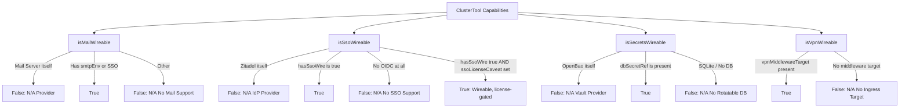

# Architectural Plan: Enhancing `tool:show` with Infrastructure Wiring Status & Tool Wireability Booleans

## 📌 Executive Summary
This document details the architectural plan to upgrade [`ToolShowCommand.php`](file:///Users/jsluchavez/Codes/Ideas/laravel-k8s/cli/app/Commands/Tool/ToolShowCommand.php) and [`AbstractToolShowCommand.php`](file:///Users/jsluchavez/Codes/Ideas/laravel-k8s/cli/app/Commands/Tool/AbstractToolShowCommand.php) in the LaraKube CLI.

A key requirement is distinguishing between:
1. **Wired**: The integration has been executed and is active.
2. **Not Wired**: The tool supports the integration, but `*:wire` has not been run yet.
3. **Not Wireable (N/A)**: The tool is the provider server itself (e.g. Stalwart for Mail, Zitadel for SSO, OpenBao for Secrets), lacks a rotatable DB (e.g. embedded SQLite), or genuinely has no SSO/OIDC of its own (Sendrec — see state 4, this is a design choice not a gap).
4. **Wireable, license-gated**: `sso:wire` runs and injects real credentials the app genuinely reads, but the app refuses to use them without a paid license even self-hosted (Directus v12's MSCL license moved SSO out of the free Core tier). Distinct from N/A because the wiring is real and ready — nothing needs to be redone once a license is bought — but distinct from plain "Wired" because login will not work yet. Driven by `ClusterTool::ssoLicenseCaveat()`.

Sendrec (`RECORD`) is **not** an SSO gap: it has no generic OIDC provider of its own, so it's deliberately routed through the shared Traefik ForwardAuth + OAuth2-Proxy middleware instead of in-app OIDC (`ClusterTool::usesForwardAuth()`, ADR 0006) — SSO genuinely works for it, just via a different mechanism than `oidcEnv()`-based tools. `checkToolWiring()` already special-cases this in `isToolWiredToSso()` (checking the ingress annotation instead of a client-id secret); the matrix below should reflect it as wired-via-ForwardAuth, not N/A.

---

## 🧭 1. Wireability Rules & Capability Booleans

We add explicit wireability methods to [`ClusterTool`](file:///Users/jsluchavez/Codes/Ideas/laravel-k8s/cli/app/Enums/ClusterTool.php):



### Capability Resolution Matrix:

| Tool | `isMailWireable()` | `isSsoWireable()` | `isSecretsWireable()` | `isVpnWireable()` |
| :--- | :---: | :---: | :---: | :---: |
| **Mail (Stalwart)** | ❌ *N/A (Provider)* | ✅ | ✅ | ✅ |
| **SSO (Zitadel)** | ✅ | ❌ *N/A (Provider)* | ✅ | ✅ |
| **Secrets (OpenBao)** | ❌ | ✅ | ❌ *N/A (Provider)* | ✅ |
| **Directus (Data)** | ✅ | ⚠️ *Wireable, license-gated (Directus v12 MSCL)* | ✅ | ✅ |
| **PocketBase (Data)** | ✅ | ✅ | ✅ | ✅ |
| **n8n (Flow)** | ✅ | ✅ | ✅ | ✅ |
| **Sendrec (Record)** | ✅ | ✅ *ForwardAuth-gated, not oidcEnv()-based* | ✅ | ✅ |
| **Bulwark (Webmail)**| ✅ | ❌ *N/A (No SSO)* | ❌ *N/A (No DB)* | ✅ |

---

## 🏗️ 2. Trait & Enum Implementation Details

### Step 1: Add Wireability Booleans to `ClusterTool.php`
Location: [`cli/app/Enums/ClusterTool.php`](file:///Users/jsluchavez/Codes/Ideas/laravel-k8s/cli/app/Enums/ClusterTool.php)

```php
public function isMailWireable(): bool
{
    if ($this === self::MAIL) {
        return false; // Stalwart IS the mail server
    }

    return $this->smtpEnv() !== null || $this === self::SSO;
}

public function isSsoWireable(): bool
{
    if ($this === self::SSO) {
        return false; // Zitadel IS the Identity Provider
    }

    return $this->hasSsoWire();
}

public function isSecretsWireable(): bool
{
    if ($this === self::SECRETS) {
        return false; // OpenBao IS the Secrets vault
    }

    return $this->dbSecretRef() !== null;
}

public function isVpnWireable(): bool
{
    return $this->vpnMiddlewareTarget() !== null;
}
```

---

### Step 2: Implement `InteractsWithToolWiring` Trait
Location: `cli/app/Traits/InteractsWithToolWiring.php`

```php
namespace App\Traits;

use App\Enums\ClusterTool;
use Illuminate\Support\Facades\Process;

trait InteractsWithToolWiring
{
    use InteractsWithSso, InteractsWithToolRegistry, ReadsClusterSecrets, SyncsClusterSecrets;

    // $engine matters for DATA: ssoLicenseCaveat() defaults to
    // defaultEngine() (pocketbase, no caveat) when null, so callers showing
    // a live Directus install must resolve and pass the actual engine —
    // same as oidcEnv()/isToolWiredToSso() already require for DATA.
    public function checkToolWiring(string $kubectl, ClusterTool $tool, ?string $engine = null): array
    {
        return [
            'mail' => [
                'wireable' => $tool->isMailWireable(),
                'wired' => $tool->isMailWireable() && $this->isToolWiredToMail($kubectl, $tool),
                'reason' => $tool === ClusterTool::MAIL ? 'Mail Server' : 'No Outbound Email',
            ],
            'sso' => [
                'wireable' => $tool->isSsoWireable(),
                'wired' => $tool->isSsoWireable() && $this->isToolWiredToSso($kubectl, $tool),
                'reason' => $tool === ClusterTool::SSO ? 'Identity Provider' : 'No SSO Support',
                // Set even when 'wired' is true — sso:wire injects real credentials
                // regardless of license state, so a tool can be BOTH wired AND
                // caveat-flagged (Directus). tool:show renders this as a distinct
                // "Wired (license required)" state rather than a plain ✓.
                'caveat' => $tool->ssoLicenseCaveat($engine),
            ],
            'secrets' => [
                'wireable' => $tool->isSecretsWireable(),
                'wired' => $tool->isSecretsWireable() && $this->isToolWiredToSecrets($kubectl, $tool),
                'reason' => $tool === ClusterTool::SECRETS ? 'Secrets Manager' : 'No Rotatable DB',
            ],
            'vpn' => [
                'wireable' => $tool->isVpnWireable(),
                'wired' => $tool->isVpnWireable() && $this->isToolWiredToVpn($kubectl, $tool),
                'reason' => 'No Ingress Target',
            ],
        ];
    }

    protected function isToolWiredToMail(string $kubectl, ClusterTool $tool): bool
    {
        if ($tool === ClusterTool::SSO) {
            return $this->readClusterSecretKey($kubectl, 'larakube-shared', 'mail-sender', 'sender') !== null;
        }

        if ($tool === ClusterTool::CHAT) {
            return $this->readClusterSecretKey($kubectl, 'larakube-shared', 'chat-smtp', 'host') !== null;
        }

        $schema = $tool->smtpEnv();
        if ($schema === null) {
            return false;
        }

        return $this->readClusterSecretKey($kubectl, $schema['namespace'], $schema['secret'], array_key_first($schema['vars']) ?: 'host') !== null;
    }

    protected function isToolWiredToSso(string $kubectl, ClusterTool $tool): bool
    {
        if ($tool->usesForwardAuth()) {
            $ns = $tool->namespace();
            $ingress = $tool->deploymentName();
            $out = Process::run("{$kubectl} get ingress {$ingress} -n {$ns} -o jsonpath='{.metadata.annotations}'")->output();

            return str_contains($out, 'sso-forwardauth');
        }

        $ssoAppSecret = "sso-app-{$tool->value}";

        return $this->readClusterSecretKey($kubectl, 'larakube-shared', $ssoAppSecret, 'client-id') !== null;
    }

    protected function isToolWiredToSecrets(string $kubectl, ClusterTool $tool): bool
    {
        $ref = $tool->dbSecretRef();
        if ($ref === null) {
            return false;
        }

        $out = trim(Process::run("{$kubectl} get externalsecret {$ref['secret']}-db -n {$ref['namespace']} --no-headers --ignore-not-found")->output());

        return $out !== '';
    }

    protected function isToolWiredToVpn(string $kubectl, ClusterTool $tool): bool
    {
        $out = Process::run("{$kubectl} get ingress {$tool->value} -n {$tool->namespace()} -o jsonpath='{.metadata.annotations}' --ignore-not-found")->output();

        return str_contains($out, 'vpn-allowlist') || str_contains($out, 'vpn-only');
    }
}
```

---

## 🎨 3. UI Rendering Standard

### Interactive Dropdown (`larakube tool:show`)
For wireable tools, show `✓` or `✗`. For non-wireable tools, display `N/A` or omit tag to avoid clutter. A license-gated SSO caveat gets its own `⚠` tag, distinct from both:

```
Directus — Directus Headless CMS [Mail: ✓ | SSO: ⚠ Wired (license required) | Secrets: ✓ | VPN: ✓]
Bulwark — Webmail UI [Mail: ✓ | SSO: N/A | Secrets: N/A | VPN: ✓]
Stalwart — Mail Server [Mail: N/A | SSO: ✓ | Secrets: ✓ | VPN: ✓]
Sendrec — Record Storage [Mail: ✓ | SSO: ✓ (ForwardAuth) | Secrets: ✓ | VPN: ✓]
```

### Table View (`{tool}:show` / `AbstractToolShowCommand`)
In the status table output, non-wireable integrations render cleanly as `<fg=gray>N/A (Reason)</>`. A wired-but-license-gated integration renders as `<fg=yellow>⚠ Wired (license required)</>` — driven by the `caveat` key from `checkToolWiring()`, checked before falling back to the plain green/gray states:

```
┌───────────────────┬────────────────────────────────────────────────────────┐
│ Component         │ Access                                                 │
├───────────────────┼────────────────────────────────────────────────────────┤
│ Bulwark Webmail   │ https://webmail.dev.test                               │
│ Mail Integration  │ <fg=green>Wired (Stalwart SMTP)</>                    │
│ SSO Integration   │ <fg=gray>N/A (No SSO Support)</>                       │
│ Secrets          │ <fg=gray>N/A (No Rotatable DB)</>                      │
│ VPN Security      │ <fg=green>Restricted (NetBird VPN Only)</>            │
└───────────────────┴────────────────────────────────────────────────────────┘
```

Directus, the license-gated example — `wired: true` and the caveat both show, because the credentials are genuinely injected:

```
┌───────────────────┬────────────────────────────────────────────────────────┐
│ Component         │ Access                                                 │
├───────────────────┼────────────────────────────────────────────────────────┤
│ Directus CMS      │ https://data.dev.test                                  │
│ SSO Integration   │ <fg=yellow>⚠ Wired (license required — Directus v12    │
│                   │ MSCL, self-hosted included; run larakube sso:wire      │
│                   │ once you have a license — no redeploy needed)</>       │
└───────────────────┴────────────────────────────────────────────────────────┘
```

---

## 🧪 4. Testing & Verification Plan

### Pest Test Coverage (`cli/tests/Feature/ToolShowWiringTest.php`):
1. **Wireability Booleans Test**: Assert `$tool->isMailWireable()`, `$tool->isSsoWireable()`, `$tool->isSecretsWireable()`, `$tool->isVpnWireable()` for Stalwart, Zitadel, OpenBao, Directus, and Sendrec.
2. **Table Output Test**: Verify `N/A` statuses render for Stalwart and Bulwark, the `⚠ Wired (license required)` state renders for Directus (`ssoLicenseCaveat('directus')` non-null), and Sendrec renders as plain `✓ Wired` (ForwardAuth), not N/A.
3. **JSON Output Metadata**: Verify `tool:show --json` returns structured metadata. Sendrec is wireable and wired via ForwardAuth — not the N/A case a naive reading of `oidcEnv() === null` would suggest:
   ```json
   {
     "tool": "record",
     "installed": true,
     "wiring": {
       "mail": { "wireable": true, "wired": false },
       "sso": { "wireable": true, "wired": true, "reason": null, "caveat": null },
       "secrets": { "wireable": true, "wired": true },
       "vpn": { "wireable": true, "wired": false }
     }
   }
   ```
   And Directus, showing the license caveat alongside a genuinely `wired: true`:
   ```json
   {
     "tool": "data",
     "engine": "directus",
     "installed": true,
     "wiring": {
       "sso": {
         "wireable": true,
         "wired": true,
         "reason": null,
         "caveat": "Directus v12 moved SSO/OIDC out of its free Core tier (MSCL license, June 2026) — a paid Team/Enterprise license (or their Open Innovation Grant) is required even self-hosted. This wiring is ready to go the moment you have one; login will not work until then."
       }
     }
   }
   ```
