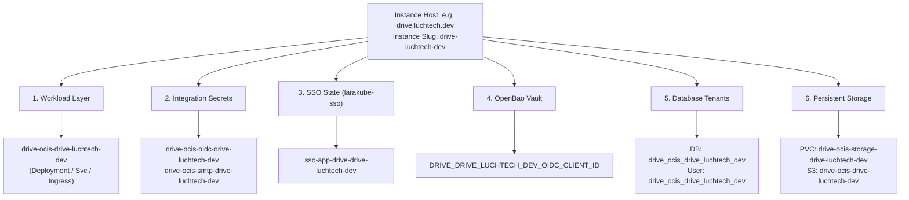

# Unified Resource Naming Architecture & Zero-Data-Loss Migration Plan

## 1. Goal Description
Standardize all LaraKube companion services and infrastructure resources to a strict, day-1 multi-instance native naming convention across all six architectural layers:
1. **Workloads & Networking** (`Deployment`, `Pod`, `Service`, `Ingress`, `ConfigMap`)
2. **Integration Secrets** (`OIDC`, `SMTP`)
3. **Control Plane & SSO State** (`sso-app-{$category}-{$instance}` in `larakube-sso`)
4. **Vault / OpenBao Secret Keys** (`{$CATEGORY}_{INSTANCE_SLUG}_*`)
5. **Database Tenants & Roles** (`PostgreSQL / MySQL Databases & Users`, `Redis Indices`)
6. **Persistent Storage** (`PVCs`, `S3/SeaweedFS Object Buckets`)

To maintain architectural purity, the LaraKube CLI will **not** expose temporary migration verbs. The CLI is pure day-1 multi-instance aware; existing live clusters will be migrated via automated, idempotent migration runbook scripts.

---

## 2. Agreed Architectural Design



### Resource Naming Standards Matrix

| Layer | Standard Pattern | Example (`MONITOR`) | Example (`PASSWORDS`) | Example (`DRIVE`) |
|---|---|---|---|---|
| **Deployment / Service** | `{$category}-{$app}-{$instance}` | `monitor-grafana-monitor-luchtech-dev` | `passwords-vaultwarden-vault-luchtech-dev` | `drive-ocis-drive-luchtech-dev` |
| **Ingress** | `{$category}-{$app}-{$instance}` | `monitor-grafana-monitor-luchtech-dev` | `passwords-vaultwarden-vault-luchtech-dev` | `drive-ocis-drive-luchtech-dev` |
| **OIDC Secret** | `{$category}-{$app}-oidc-{$instance}` | `monitor-grafana-oidc-monitor-luchtech-dev` | `passwords-vaultwarden-oidc-vault-luchtech-dev` | `drive-ocis-oidc-drive-luchtech-dev` |
| **SMTP Secret** | `{$category}-{$app}-smtp-{$instance}` | `monitor-grafana-smtp-monitor-luchtech-dev` | `passwords-vaultwarden-smtp-vault-luchtech-dev` | `drive-ocis-smtp-drive-luchtech-dev` |
| **Zitadel App Secret** | `sso-app-{$category}-{$instance}` | `sso-app-monitor-monitor-luchtech-dev` | `sso-app-passwords-vault-luchtech-dev` | `sso-app-drive-drive-luchtech-dev` |
| **OpenBao Key** | `{$CAT}_{SLUG}_OIDC_*` | `MONITOR_MONITOR_LUCHTECH_DEV_OIDC_*` | `PASSWORDS_VAULT_LUCHTECH_DEV_OIDC_*` | `DRIVE_DRIVE_LUCHTECH_DEV_OIDC_*` |
| **Database & User (Postgres)** | `{$category}_{$app}_{$dbInstance}` | `monitor_grafana_monitor_luchtech_dev` | `passwords_vaultwarden_vault_luchtech_dev` | N/A (LDAP / S3 metadata) |
| **PVC (Block Storage)** | `{$category}-{$app}-storage-{$instance}` | `monitor-prometheus-storage-monitor-luchtech-dev` | `passwords-vaultwarden-storage-vault-luchtech-dev` | `drive-ocis-storage-drive-luchtech-dev` |
| **S3 Object Bucket** | `{$category}-{$app}-{$instance}` | N/A | N/A | `drive-ocis-drive-luchtech-dev` |

---

## 3. Database Tenant Naming & Atomic Renaming Strategy

PostgreSQL databases and user roles can be renamed **atomically and in-place** without copying files on disk:

```sql
-- Atomic Rename in PostgreSQL Commons:
ALTER DATABASE old_name RENAME TO new_name;
ALTER ROLE old_user RENAME TO new_user;
```

### Full Database Matrix Across All Tools

| Tool Enum | Product | Old / Current DB Name | Target Multi-Instance Standard | Rename Method |
|---|---|---|---|:---:|
| `MONITOR` | Grafana | `grafana` | `monitor_grafana_{$dbInstance}` | `ALTER DATABASE / ROLE` |
| `PASSWORDS` | Vaultwarden | `vaultwarden` | `passwords_vaultwarden_{$dbInstance}` | `ALTER DATABASE / ROLE` |
| `LINK` | Kutt | `link_kutt` | `link_kutt_{$dbInstance}` | `ALTER DATABASE / ROLE` |
| `ERRORS` | GlitchTip | `glitchtip` | `errors_glitchtip_{$dbInstance}` | `ALTER DATABASE / ROLE` |
| `ANALYTICS` | Umami | `umami` | `analytics_umami_{$dbInstance}` | `ALTER DATABASE / ROLE` |
| `INSIGHTS` | Metabase | `metabase` | `insights_metabase_{$dbInstance}` | `ALTER DATABASE / ROLE` |
| `CRM` | Twenty | `twenty` | `crm_twenty_{$dbInstance}` | `ALTER DATABASE / ROLE` |
| `FLOW` | n8n / Windmill | `n8n` / `windmill` | `flow_n8n_{$dbInstance}` / `flow_windmill_{$dbInstance}` | `ALTER DATABASE / ROLE` |
| `SSO` | Zitadel | `zitadel` | `sso_zitadel_{$dbInstance}` | `ALTER DATABASE / ROLE` |
| `SECRETS` | OpenBao | `openbao` | `secrets_openbao_{$dbInstance}` | `ALTER DATABASE / ROLE` |
| `NOTES` | Outline | `notes_outline` | `notes_outline_{$dbInstance}` | `ALTER DATABASE / ROLE` |
| `SIGN` | Documenso | `sign_documenso` | `sign_documenso_{$dbInstance}` | `ALTER DATABASE / ROLE` |
| `RECORD` | Sendrec | `record_sendrec` | `record_sendrec_{$dbInstance}` | `ALTER DATABASE / ROLE` |
| `RESUME` | Reactive Resume | `resume_reactive_resume` | `resume_reactive_resume_{$dbInstance}` | `ALTER DATABASE / ROLE` |
| `SHEETS` | Teable | `sheet_teable` | `sheet_teable_{$dbInstance}` | `ALTER DATABASE / ROLE` |
| `SUPPORT` | Chatwoot | `support_chatwoot` | `support_chatwoot_{$dbInstance}` | `ALTER DATABASE / ROLE` |
| `TASKS` | Planka | `tasks_planka` | `tasks_planka_{$dbInstance}` | `ALTER DATABASE / ROLE` |
| `DESK` | FreeScout | `desk_freescout` (MySQL) | `desk_freescout_{$dbInstance}` | Rename table schema |
| `DESIGN` | Penpot | `design_penpot` | `design_penpot_{$dbInstance}` | `ALTER DATABASE / ROLE` |
| `DATA` | Directus / PB | `data_directus` / `data_pocketbase` | `data_directus_{$dbInstance}` | `ALTER DATABASE / ROLE` |
| `CHAT` | Synapse / MAS | `chat_matrix`, `chat_mas` | `chat_matrix`, `chat_mas` | Singleton |
| `MAIL` | Stalwart | `mail_stalwart` | `mail_stalwart_{$dbInstance}` | `ALTER DATABASE / ROLE` |

---

## 3b. VPN (NetBird) — added 2026-08-29

VPN was never in this plan and is the last tool still using raw vendor names. It is also
the cheapest to migrate: the whole stack is disposable (`vpn:remove --purge` + `vpn:init`
rebuilds it), so no data-preservation phase applies — every peer simply re-enrols.

### The rule this exercise clarified

**The database token is the same token as the Deployment that owns it.** Verified against
the live cluster: `monitor-grafana-*` ↔ `monitor_grafana`, `link-kutt-*` ↔ `link_kutt`,
`passwords-vaultwarden-*` ↔ `passwords_vaultwarden`. The middle token is the *component*,
not the vendor — `chat-admin-*`, `chat-coturn-*`, `chat-mas-*`, `monitor-loki-*` are all
`{category}-{component}-{instance}`.

That is why NetBird's store is `vpn_management_{dbInstance}` and **not** `vpn_netbird_*`:
nothing is ever deployed as `vpn-netbird-*`, so a `vpn_netbird` tenant would be the one
name in the cluster with no workload to match it.

### VPN target names

| Layer | Current | Target |
|---|---|---|
| Deployment / Service | `netbird-management` | `vpn-management-{$instance}` |
| | `netbird-signal` | `vpn-signal-{$instance}` |
| | `netbird-relay` | `vpn-relay-{$instance}` |
| | `netbird-dashboard` | `vpn-dashboard-{$instance}` |
| | `netbird-client` | `vpn-client-{$instance}` |
| Ingress | `netbird-management` | `vpn-management-{$instance}` |
| PVC | `netbird-management-storage` | `vpn-management-storage-{$instance}` |
| | `netbird-client-data` | `vpn-client-storage-{$instance}` |
| Secrets | `vpn-secrets` | `vpn-management-secrets-{$instance}` |
| | `vpn-store` | `vpn-management-store-{$instance}` |
| | `netbird-oidc` | `vpn-management-oidc-{$instance}` |
| | `netbird-relay-secret` | `vpn-management-config-{$instance}` |
| Database & role | `vpn_netbird` | `vpn_management_{$dbInstance}` ✅ **done 2026-08-29** |

### Why the database half was done first, separately

A tenant is created at `vpn:init` and is expensive to rename afterwards; the workload names
can be changed at any time by re-initing. So `VpnTool::commonsDatabaseList()` was corrected
to `['vpn_management']` immediately, ahead of the rest.

### The failure mode this whole item came from

`vpn:init` had the database name hardcoded while `vpn:remove --purge` derives it from
`commonsDatabases($instance)`. The two disagreed, and because `DROP DATABASE IF EXISTS` on a
name that never existed **reports success**, `--purge` silently dropped nothing. The next
`vpn:init` then reconnected to a store that still had its owner and failed with
`412 setup already completed`. Confirmed live 2026-08-29.

`vpn:init` now derives the name from the same call `--purge` uses, with a test asserting the
two produce the identical string. **Any tool that names a tenant independently of
`commonsDatabases()` has this bug and it is invisible** — worth grepping for during Phases
1–3 rather than trusting each `*InitCommand`.

### Scope

435 occurrences across 41 files. The names also become *dynamic* rather than merely
different — blades and commands must thread the instance through — so this is a focused pass,
not a search-and-replace. `VpnTool::components()`, `baseDeploymentName()` and
`presenceProbe()` already accept `?string $instance`, so the enum layer is ready.

### Adjacent bug found while investigating

`SSO` registers with instance `main`, so `commonsDatabases('main')` computes `zitadel_main` —
but the live database is `zitadel`. **`sso:remove --purge` would therefore fail to drop it,
silently, exactly as VPN did.** `crm_twenty_main` and `crm_twenty_crm_luchtech_dev` both
exist live, which looks like the same churn. Not fixed here.

---

## 4. High-Stakes Crypto & Storage Safety Standard

> [!CAUTION]
> For services like **oCIS (`DRIVE`)**, **Vaultwarden (`PASSWORDS`)**, **Forgejo (`GIT`)**, and **OpenBao (`SECRETS`)**, desyncing or regenerating cryptographic master keys (`jwt-secret`, `rekey-key`, `machine-auth-api-key`, `ADMIN_TOKEN`, RSA keys) will cause **permanent, irrecoverable data loss**.

### Dual-Phase Zero-Loss Cutover Protocol:
1. **Phase A (Secret & DB Preservation)**:
   - Read the existing master secret (e.g. `drive-secrets` or `vault-secrets`).
   - Clone every cryptographic key byte-for-byte into the new suffixed secret name (`drive-ocis-secrets-{$instance}`).
   - Atomically rename database tenant (`ALTER DATABASE old RENAME TO new;`).
   - Verify all keys match via SHA256 checksums before proceeding.
2. **Phase B (Workload Lock & Data Transfer)**:
   - Scale active deployment to `replicas: 0` to flush writes and release OS/TSDB file locks.
   - Run a one-shot Kubernetes `Job` (`pvc-copy-job`) mounting `/source` (old PVC) and `/target` (new PVC).
   - Execute `rsync -aHAX --delete /source/ /target/` to preserve extended attributes, permissions, and symlinks.
   - Verify byte count and directory structure match.
3. **Phase C (Cutover & Validation)**:
   - Deploy new instance-suffixed workload mounting the new PVC, new database credentials, and new secrets.
   - Run readiness probes and live user authentication/file access checks.
   - **Old legacy PVCs and secrets are NEVER deleted automatically**; they are retained until explicit operator sign-off.

---

## 5. Rollout Execution Phases

### Phase 1: Stateless & Low-Stakes (Codebase & Live Alignment)
- **Scope**:
  - Update `ClusterTool.php`, `SsoWireCommand.php`, `MailWireCommand.php`, `SsoUnwireCommand.php`, and `MailUnwireCommand.php` to use `{$category}-{$app}-oidc-{$instance}`, `{$category}-{$app}-smtp-{$instance}`, and `sso-app-{$category}-{$instance}`.
  - Update `MonitorTool.php`, `LinkTool.php`, `PasswordTool.php`, `DriveTool.php`, `ErrorTool.php`, `TaskTool.php`.
  - Prometheus & Loki PVCs.
- **Deliverables**:
  - Full Pest suite green (`pest --parallel`).
  - PHPStan 0 errors (`Level 5`).

### Phase 2: Object-Backed & Database Tenant Tools
- **Scope**:
  - `NOTES` (Outline), `SIGN` (Documenso), `DESIGN` (Penpot), `RESUME` (Reactive Resume), `CRM` (Twenty).
  - S3 bucket naming alignment (`{$category}-{$app}-{$instance}`) + Postgres tenant alignment (`{$category}_{$app}_{$dbInstance}`).
  - S3 object sync via `mc mirror` script.

### Phase 3: High-Stakes Crypto & Block Storage (oCIS, Vaultwarden, Forgejo, Stalwart)
- **Scope**:
  - `DRIVE` (oCIS): `drive-ocis-storage-{$instance}` + `drive-ocis-secrets-{$instance}`.
  - `PASSWORDS` (Vaultwarden): `passwords-vaultwarden-storage-{$instance}` + `passwords-vaultwarden-secrets-{$instance}` + `passwords_vaultwarden_{$dbInstance}` DB.
  - `GIT` (Forgejo): `git-forgejo-storage-{$instance}` + `git-forgejo-secrets-{$instance}` + `git_forgejo_{$dbInstance}` DB.
  - `MAIL` (Stalwart): `mail-stalwart-storage-{$instance}` + `mail-stalwart-secrets-{$instance}` + `mail_stalwart_{$dbInstance}` DB.
- **Deliverables**:
  - Automated migration runbook script (`cli/scripts/migrations/migrate-live-cluster.sh`).
  - Verified against test and live clusters.

---

## 6. Verification Plan

### Automated Tests
- `./php vendor/bin/pest --parallel` (All unit/feature tests for `sso:wire`, `mail:wire`, `*:init`, `*:remove`).
- `./php vendor/bin/phpstan analyse` (Static analysis level 5).
- `./php vendor/bin/pint` (Code formatting).

### Live Safety Verification
- Pre-flight secret checksum match before any scale-down.
- Database tenant connection check via `SELECT 1;`.
- PVC copy Job completion with exit code 0 and non-empty target directory.
- Post-migration HTTP 200 checks on WebDAV, OIDC login, and Vaultwarden sync.
