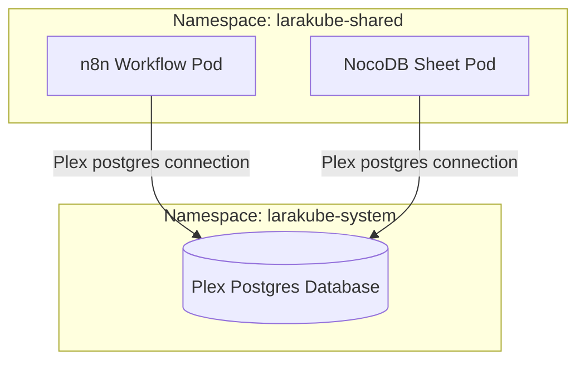

# Planning Integration for Workflow Automation (Flow) & No-Code Database (Sheet)

This document outlines the complete architectural design and code implementation plan for introducing workflow automation (powered by **N8N**) and no-code database spreadsheet interfaces (powered by **NocoDB**) into the LaraKube CLI.

---

## 🎯 Conceptual Naming & Commands
To align with LaraKube CLI's functional noun conventions (e.g., `monitor:init` for Grafana, `errors:init` for GlitchTip, `git:init` for Gitea), we avoid service-specific brand names in the top-level commands:

1. **`flow:init` (Workflow Automation - N8N)**
   * **Noun**: `flow` (representing workflows and integration flows).
   * **Command**: `larakube flow:init`
   * **Namespace**: `App\Commands\Flow\FlowInitCommand`
   * **Enum Case**: `SharedClusterService::FLOW` (`flow.kube`)

2. **`sheet:init` (No-Code Database Spreadsheet - NocoDB)**
   * **Noun**: `sheet` (representing the visual collaborative spreadsheet UI).
   * **Command**: `larakube sheet:init`
   * **Namespace**: `App\Commands\Sheet\SheetInitCommand`
   * **Enum Case**: `SharedClusterService::SHEET` (`sheet.kube`)
   * **Note**: NocoDB is deployed as a first-class **Shared Cluster Service** rather than a stateless companion, as it maintains metadata, users, views, and integrations.

---

## 🐘 Database Sharing: Plex Commons Integration

To prevent container/volume bloat and optimize cluster resources, both `flow` (`n8n`) and `sheet` (`nocodb`) will integrate with the cluster's **Plex Commons PostgreSQL database** instead of launching dedicated, duplicate Postgres instances.



### 1. Database Allocation Flow
* When `flow:init` or `sheet:init` runs, they will check for Plex Commons presence via `ensureCommons(['postgres'])`.
* If present, they will dynamically generate db passwords and allocate their own schemas in the shared Postgres cluster using the `allocateDatabase` trait method:
  * `flow` will allocate database `n8n` with user `n8n`.
  * `sheet` will allocate database `nocodb` with user `nocodb`.
* If Plex is removed or absent, the CLI handles cleanup via `buildDropTenantSql` during `flow:init --remove` or `sheet:init --remove`.

### 2. Ephemeral Fallback (`--no-plex`)
* Both commands will support a `--no-plex` flag.
* If `--no-plex` is passed (or if Plex Commons is not installed in the cluster), the services will fall back to using SQLite storage inside a PersistentVolumeClaim:
  * For N8N: `NC_DB=sqlite:////home/node/.n8n/n8n.db`
  * For NocoDB: `NC_DB=sqlite:////usr/app/data/noco.db`
* This keeps local development fast and zero-dependency, while fully supporting cloud/production-ready Postgres scaling.

---

## 🔒 VPN-Only Access (Ingress Restrictions)
To allow developers to lock down access to these administrative tools (especially when deployed on managed Kubernetes cloud clusters):
* Both `flow:init` and `sheet:init` support a `--vpn-only` flag.
* When `--vpn-only` is provided, a Traefik `Middleware` resource restricting traffic to the NetBird overlay CIDR range (`100.64.0.0/10`), loopback (`127.0.0.1/32`), and internal pod/service CIDRs (`10.42.0.0/16`, `10.43.0.0/16`) is deployed.
* The Ingress routing for these tools is annotated to route through the middleware, preventing public access:
  * Annotation: `traefik.ingress.kubernetes.io/router.middlewares: larakube-shared-flow-vpn-only@kubernetescrd` (or `sheet-vpn-only`).

---

## 📂 Implementation Code Structure

### 1. Enum Definition (`app/Enums/SharedClusterService.php`)

```php
// Add the cases:
case FLOW = 'flow';
case SHEET = 'sheet';

// Add to template():
self::FLOW => 'k8s.flow.ingress',
self::SHEET => 'k8s.sheet.ingress',

// Add to hostPrefix():
self::FLOW => 'flow',
self::SHEET => 'sheet',

// Add to isLocalOnly():
self::GRAFANA, self::UPTIME_KUMA, self::VAULT, self::VPN, self::ERRORS, self::SECRETS, self::GITEA, self::FLOW, self::SHEET => false,

// Add to label():
self::FLOW => 'n8n',
self::SHEET => 'NocoDB',

// Add to presenceProbe():
self::FLOW => 'deployment flow-n8n -n larakube-shared',
self::SHEET => 'deployment sheet-nocodb -n larakube-shared',

// Add to reconcileLabel():
self::FLOW => 'Refreshing Flow (n8n) ingress...',
self::SHEET => 'Refreshing Sheet (NocoDB) ingress...',
```

---

### 2. Flow Helper Trait (`app/Traits/InteractsWithFlow.php`)

```php
<?php

namespace App\Traits;

use App\Data\ConfigData;
use App\Data\GlobalConfigData;
use App\Enums\SharedClusterService;
use Illuminate\Support\Facades\Process;

trait InteractsWithFlow
{
    use ResolvesEnvironmentContext;

    /** The namespace the flow stack lives in. */
    protected function flowNamespace(): string
    {
        return 'larakube-shared';
    }

    /** Build the kubectl command, optionally scoped to a specific context. */
    protected function flowKubectl(?string $context = null): string
    {
        $context = (string) ($context ?? '');
        $kubectl = 'KUBECONFIG='.escapeshellarg(home_path('.kube/config')).' kubectl';

        return $context !== '' ? "{$kubectl} --context={$context}" : $kubectl;
    }

    /** Flow (n8n) Deployment present? */
    protected function isFlowInstalled(string $kubectl, string $ns): bool
    {
        $out = Process::run("{$kubectl} get deployment flow-n8n -n {$ns} --no-headers")->output();

        return trim($out) !== '';
    }

    /** Read flow encryption key. */
    protected function readFlowEncryptionKey(string $kubectl, string $ns): ?string
    {
        $out = trim(Process::run(
            "{$kubectl} get secret flow-secrets -n {$ns} -o jsonpath='{.data.encryption-key}'",
        )->output());

        return $out !== '' ? (string) base64_decode($out) : null;
    }

    /** Read flow database password. */
    protected function readFlowDbPassword(string $kubectl, string $ns): ?string
    {
        $out = trim(Process::run(
            "{$kubectl} get secret flow-secrets -n {$ns} -o jsonpath='{.data.db-password}'",
        )->output());

        return $out !== '' ? (string) base64_decode($out) : null;
    }

    /** Read-only Flow host for an env. */
    protected function resolveFlowHostReadOnly(string $env, ?ConfigData $config): ?string
    {
        $service = SharedClusterService::FLOW;

        if ($env === 'local') {
            return $service->hostFor(GlobalConfigData::load()->getLocalTld());
        }

        return $config?->getEnvironment($env)?->hosts[$service->value] ?? null;
    }

    /** Resolve Flow's access details. */
    protected function flowAccess(string $env, ?ConfigData $config, ?string $context = null): ?array
    {
        $kubectl = $this->flowKubectl($context);
        $ns = $this->flowNamespace();

        if (! $this->isFlowInstalled($kubectl, $ns)) {
            return null;
        }

        return [
            'host' => $this->resolveFlowHostReadOnly($env, $config),
            'label' => 'n8n',
        ];
    }
}
```

---

### 3. Sheet Helper Trait (`app/Traits/InteractsWithSheet.php`)

```php
<?php

namespace App\Traits;

use App\Data\ConfigData;
use App\Data\GlobalConfigData;
use App\Enums\SharedClusterService;
use Illuminate\Support\Facades\Process;

trait InteractsWithSheet
{
    use ResolvesEnvironmentContext;

    /** The namespace the sheet stack lives in. */
    protected function sheetNamespace(): string
    {
        return 'larakube-shared';
    }

    /** Build the kubectl command. */
    protected function sheetKubectl(?string $context = null): string
    {
        $context = (string) ($context ?? '');
        $kubectl = 'KUBECONFIG='.escapeshellarg(home_path('.kube/config')).' kubectl';

        return $context !== '' ? "{$kubectl} --context={$context}" : $kubectl;
    }

    /** Sheet (nocodb) Deployment present? */
    protected function isSheetInstalled(string $kubectl, string $ns): bool
    {
        $out = Process::run("{$kubectl} get deployment sheet-nocodb -n {$ns} --no-headers")->output();

        return trim($out) !== '';
    }

    /** Read database password. */
    protected function readSheetDbPassword(string $kubectl, string $ns): ?string
    {
        $out = trim(Process::run(
            "{$kubectl} get secret sheet-secrets -n {$ns} -o jsonpath='{.data.db-password}'",
        )->output());

        return $out !== '' ? (string) base64_decode($out) : null;
    }

    /** Read-only Sheet host. */
    protected function resolveSheetHostReadOnly(string $env, ?ConfigData $config): ?string
    {
        $service = SharedClusterService::SHEET;

        if ($env === 'local') {
            return $service->hostFor(GlobalConfigData::load()->getLocalTld());
        }

        return $config?->getEnvironment($env)?->hosts[$service->value] ?? null;
    }

    /** Resolve Sheet's access details. */
    protected function sheetAccess(string $env, ?ConfigData $config, ?string $context = null): ?array
    {
        $kubectl = $this->sheetKubectl($context);
        $ns = $this->sheetNamespace();

        if (! $this->isSheetInstalled($kubectl, $ns)) {
            return null;
        }

        return [
            'host' => $this->resolveSheetHostReadOnly($env, $config),
            'label' => 'NocoDB',
        ];
    }
}
```

---

### 4. Flow Init Command (`app/Commands/Flow/FlowInitCommand.php`)

```php
<?php

namespace App\Commands\Flow;

use App\Data\ConfigData;
use App\Enums\SharedClusterService;
use App\Traits\InteractsWithClusterContext;
use App\Traits\InteractsWithFlow;
use App\Traits\InteractsWithPlex;
use App\Traits\LaraKubeOutput;
use App\Traits\StreamsProcessOutput;
use Illuminate\Support\Facades\Process;
use Illuminate\Support\Str;
use function Laravel\Prompts\select;
use function Laravel\Prompts\text;
use LaravelZero\Framework\Commands\Command;

class FlowInitCommand extends Command
{
    use InteractsWithClusterContext, InteractsWithFlow, InteractsWithPlex, LaraKubeOutput, StreamsProcessOutput;

    protected $signature = 'flow:init
        {environment? : Environment this install targets — "local" (default) or cloud.}
        {--context=  : Target a specific kube-context}
        {--env=      : Legacy alias for the environment}
        {--domain=   : Raw override for the Flow cluster domain}
        {--no-plex   : Bypass Plex Commons and use local SQLite storage}
        {--vpn-only  : Restrict access via NetBird VPN IP whitelisting}
        {--remove    : Tear down the Flow stack}';

    protected $description = 'Deploy the workflow automation stack (n8n) into larakube-shared';

    public function handle(): int
    {
        $this->renderHeader();

        return $this->option('remove')
            ? $this->removeFlow()
            : $this->deployFlow();
    }

    protected function deployFlow(): int
    {
        $kubectl = $this->flowKubectl($this->option('context'));
        $ns = $this->flowNamespace();
        $noPlex = (bool) $this->option('no-plex');
        $vpnOnly = (bool) $this->option('vpn-only');

        if (! $noPlex) {
            if (! $this->ensureCommons(['postgres'])) {
                return 1;
            }
        }

        $host = $this->resolveFlowHost();
        $env = $this->resolveEnvironment();

        $dbPassword = $this->readFlowDbPassword($kubectl, $ns) ?? Str::random(24);
        $encryptionKey = $this->readFlowEncryptionKey($kubectl, $ns) ?? Str::random(32);

        if (! $noPlex) {
            if (! $this->allocateDatabase(\App\Enums\DatabaseDriver::POSTGRESQL, 'n8n', $dbPassword)) {
                return 1;
            }
        }

        $this->withSpin("Ensuring namespace {$ns}...", fn () => Process::run(
            "{$kubectl} create namespace {$ns} --dry-run=client -o yaml | {$kubectl} apply -f -",
        ));

        $this->withSpin('Syncing secrets...', function () use ($kubectl, $ns, $encryptionKey, $dbPassword) {
            Process::run(
                "{$kubectl} create secret generic flow-secrets -n {$ns} "
                .'--from-literal=encryption-key='.escapeshellarg($encryptionKey).' '
                .'--from-literal=db-password='.escapeshellarg($dbPassword).' '
                ."--dry-run=client -o yaml | {$kubectl} apply -f -"
            );
        });

        if ($vpnOnly) {
            $vpnMiddleware = view('k8s.flow.vpn-middleware', ['ns' => $ns])->render();
            $tmpVpn = sys_get_temp_dir().'/larakube-flow-vpn.yaml';
            file_put_contents($tmpVpn, $vpnMiddleware);
            Process::run("{$kubectl} apply -f {$tmpVpn}");
            @unlink($tmpVpn);
        }

        $manifest = view('k8s.flow.shared', [
            'host' => $host,
            'dbPassword' => $dbPassword,
            'plexNamespace' => $this->plexNamespace(),
            'noPlex' => $noPlex,
            'vpnOnly' => $vpnOnly,
        ])->render();

        $tmp = sys_get_temp_dir().'/larakube-flow.yaml';
        file_put_contents($tmp, $manifest);

        $this->withSpin('Applying Flow (n8n) manifests...', fn () => $this->runStreaming("{$kubectl} apply -f {$tmp}"));
        @unlink($tmp);

        $this->withSpin('Waiting for Flow (n8n)...', fn () => $this->runStreaming(
            "{$kubectl} rollout status deploy/flow-n8n -n {$ns} --timeout=120s",
            130
        ));

        $this->laraKubeNewLine();
        $this->laraKubeInfo('✅ Flow (n8n) stack is live.');
        $this->newLine();
        $this->line("  <fg=gray>Access URL:</>              <fg=blue>https://{$host}</>");
        if ($vpnOnly) {
            $this->line("  <fg=gray>Access Policy:</>           <fg=red>Restricted to VPN (100.64.0.0/10)</>");
        }
        $this->newLine();

        return 0;
    }

    protected function removeFlow(): int
    {
        $kubectl = $this->flowKubectl($this->option('context'));
        $ns = $this->flowNamespace();
        $plexNs = $this->plexNamespace();

        $isLocal = trim(Process::run("{$kubectl} get secret flow-secrets -n {$ns}")->output()) === '';

        if (! $isLocal) {
            $sql = $this->buildDropTenantSql('n8n', 'n8n');
            $tmp = tempnam(sys_get_temp_dir(), 'larakube_plex_drop_n8n');
            file_put_contents($tmp, $sql);
            $client = \App\Enums\DatabaseDriver::POSTGRESQL->commonsAdminClient();

            $this->withSpin("Dropping database 'n8n' from Plex Commons...", function () use ($plexNs, $client, $tmp, $kubectl) {
                return Process::run(
                    "{$kubectl} exec -i -n {$plexNs} deploy/postgres -- sh -c ".escapeshellarg($client).' < '.escapeshellarg($tmp)
                )->successful();
            });
            @unlink($tmp);
        }

        $this->withSpin('Removing Flow (n8n) resources...', fn () => Process::run(
            "{$kubectl} delete deployment/flow-n8n service/flow-n8n ingress/flow-n8n pvc/flow-storage secret/flow-secrets middleware/flow-vpn-only -n {$ns} --ignore-not-found"
        ));

        $this->laraKubeInfo('Flow (n8n) removed from larakube-shared.');

        return 0;
    }

    protected function resolveFlowHost(): string
    {
        $service = SharedClusterService::FLOW;

        $domain = (string) ($this->option('domain') ?? '');
        if ($domain !== '') {
            return $service->hostFor($domain);
        }

        $env = $this->resolveEnvironment();

        if ($env === 'local') {
            return (string) $this->resolveFlowHostReadOnly('local', null);
        }

        return $this->promptForCloudFlowHost($service, $env);
    }

    protected function resolveEnvironment(): string
    {
        $explicit = (string) ($this->argument('environment') ?: $this->option('env') ?: '');
        if ($explicit !== '') {
            return $explicit;
        }

        if ($this->option('no-interaction') || $this->option('domain')) {
            return 'local';
        }

        $projectPath = getcwd();
        $config = file_exists($projectPath.'/'.ConfigData::CONFIG_FILE)
            ? ConfigData::loadFromFile($projectPath)
            : null;

        $envs = $config ? array_merge(['local'], $config->getCloudEnvironments()) : ['local'];

        return select(
            label: 'Which environment is this Flow install for?',
            options: array_combine($envs, $envs),
            default: 'local'
        );
    }

    protected function promptForCloudFlowHost(SharedClusterService $service, string $env): string
    {
        $projectPath = getcwd();
        $config = file_exists($projectPath.'/'.ConfigData::CONFIG_FILE)
            ? ConfigData::loadFromFile($projectPath)
            : null;

        $existing = $config?->getEnvironment($env)?->hosts[$service->value] ?? null;
        if ($existing) {
            return $existing;
        }

        $webHost = $config?->getEnvironment($env)?->hosts['web'] ?? null;
        $default = ($config && $webHost) ? $config->getSharedServiceHost($service, $env) : '';

        $host = text(
            label: "What host should {$service->label()} use in '{$env}'?",
            placeholder: $default !== '' ? $default : 'e.g. flow.example.com',
            default: $default,
            required: true
        );

        if ($config) {
            $config->setHost($env, $service->value, $host);
            $config->saveToFile($projectPath);
            $this->laraKubeInfo("Saved {$service->label()} host for '{$env}' to .larakube.json");
        }

        return $host;
    }
}
```

---

### 5. Sheet Init Command (`app/Commands/Sheet/SheetInitCommand.php`)

```php
<?php

namespace App\Commands\Sheet;

use App\Data\ConfigData;
use App\Enums\SharedClusterService;
use App\Traits\InteractsWithClusterContext;
use App\Traits\InteractsWithSheet;
use App\Traits\InteractsWithPlex;
use App\Traits\LaraKubeOutput;
use App\Traits\StreamsProcessOutput;
use Illuminate\Support\Facades\Process;
use Illuminate\Support\Str;
use function Laravel\Prompts\select;
use function Laravel\Prompts\text;
use LaravelZero\Framework\Commands\Command;

class SheetInitCommand extends Command
{
    use InteractsWithClusterContext, InteractsWithSheet, InteractsWithPlex, LaraKubeOutput, StreamsProcessOutput;

    protected $signature = 'sheet:init
        {environment? : Environment this install targets — "local" (default) or cloud.}
        {--context=  : Target a specific kube-context}
        {--env=      : Legacy alias for the environment}
        {--domain=   : Raw override for the Sheet cluster domain}
        {--no-plex   : Bypass Plex Commons and use local SQLite storage}
        {--vpn-only  : Restrict access via NetBird VPN IP whitelisting}
        {--remove    : Tear down the Sheet stack}';

    protected $description = 'Deploy the no-code database spreadsheet stack (NocoDB) into larakube-shared';

    public function handle(): int
    {
        $this->renderHeader();

        return $this->option('remove')
            ? $this->removeSheet()
            : $this->deploySheet();
    }

    protected function deploySheet(): int
    {
        $kubectl = $this->sheetKubectl($this->option('context'));
        $ns = $this->sheetNamespace();
        $noPlex = (bool) $this->option('no-plex');
        $vpnOnly = (bool) $this->option('vpn-only');

        if (! $noPlex) {
            if (! $this->ensureCommons(['postgres'])) {
                return 1;
            }
        }

        $host = $this->resolveSheetHost();
        $env = $this->resolveEnvironment();

        $dbPassword = $this->readSheetDbPassword($kubectl, $ns) ?? Str::random(24);

        if (! $noPlex) {
            if (! $this->allocateDatabase(\App\Enums\DatabaseDriver::POSTGRESQL, 'nocodb', $dbPassword)) {
                return 1;
            }
        }

        $this->withSpin("Ensuring namespace {$ns}...", fn () => Process::run(
            "{$kubectl} create namespace {$ns} --dry-run=client -o yaml | {$kubectl} apply -f -",
        ));

        $this->withSpin('Syncing secrets...', function () use ($kubectl, $ns, $dbPassword) {
            Process::run(
                "{$kubectl} create secret generic sheet-secrets -n {$ns} "
                .'--from-literal=db-password='.escapeshellarg($dbPassword).' '
                ."--dry-run=client -o yaml | {$kubectl} apply -f -"
            );
        });

        if ($vpnOnly) {
            $vpnMiddleware = view('k8s.sheet.vpn-middleware', ['ns' => $ns])->render();
            $tmpVpn = sys_get_temp_dir().'/larakube-sheet-vpn.yaml';
            file_put_contents($tmpVpn, $vpnMiddleware);
            Process::run("{$kubectl} apply -f {$tmpVpn}");
            @unlink($tmpVpn);
        }

        $manifest = view('k8s.sheet.shared', [
            'host' => $host,
            'dbPassword' => $dbPassword,
            'plexNamespace' => $this->plexNamespace(),
            'noPlex' => $noPlex,
            'vpnOnly' => $vpnOnly,
        ])->render();

        $tmp = sys_get_temp_dir().'/larakube-sheet.yaml';
        file_put_contents($tmp, $manifest);

        $this->withSpin('Applying Sheet (NocoDB) manifests...', fn () => $this->runStreaming("{$kubectl} apply -f {$tmp}"));
        @unlink($tmp);

        $this->withSpin('Waiting for Sheet (NocoDB)...', fn () => $this->runStreaming(
            "{$kubectl} rollout status deploy/sheet-nocodb -n {$ns} --timeout=120s",
            130
        ));

        $this->laraKubeNewLine();
        $this->laraKubeInfo('✅ Sheet (NocoDB) stack is live.');
        $this->newLine();
        $this->line("  <fg=gray>Access URL:</>              <fg=blue>https://{$host}</>");
        if ($vpnOnly) {
            $this->line("  <fg=gray>Access Policy:</>           <fg=red>Restricted to VPN (100.64.0.0/10)</>");
        }
        $this->newLine();

        return 0;
    }

    protected function removeSheet(): int
    {
        $kubectl = $this->sheetKubectl($this->option('context'));
        $ns = $this->sheetNamespace();
        $plexNs = $this->plexNamespace();

        $isLocal = trim(Process::run("{$kubectl} get secret sheet-secrets -n {$ns}")->output()) === '';

        if (! $isLocal) {
            $sql = $this->buildDropTenantSql('nocodb', 'nocodb');
            $tmp = tempnam(sys_get_temp_dir(), 'larakube_plex_drop_nocodb');
            file_put_contents($tmp, $sql);
            $client = \App\Enums\DatabaseDriver::POSTGRESQL->commonsAdminClient();

            $this->withSpin("Dropping database 'nocodb' from Plex Commons...", function () use ($plexNs, $client, $tmp, $kubectl) {
                return Process::run(
                    "{$kubectl} exec -i -n {$plexNs} deploy/postgres -- sh -c ".escapeshellarg($client).' < '.escapeshellarg($tmp)
                )->successful();
            });
            @unlink($tmp);
        }

        $this->withSpin('Removing Sheet (NocoDB) resources...', fn () => Process::run(
            "{$kubectl} delete deployment/sheet-nocodb service/sheet-nocodb ingress/sheet-nocodb pvc/sheet-storage secret/sheet-secrets middleware/sheet-vpn-only -n {$ns} --ignore-not-found"
        ));

        $this->laraKubeInfo('Sheet (NocoDB) removed from larakube-shared.');

        return 0;
    }

    protected function resolveSheetHost(): string
    {
        $service = SharedClusterService::SHEET;

        $domain = (string) ($this->option('domain') ?? '');
        if ($domain !== '') {
            return $service->hostFor($domain);
        }

        $env = $this->resolveEnvironment();

        if ($env === 'local') {
            return (string) $this->resolveSheetHostReadOnly('local', null);
        }

        return $this->promptForCloudSheetHost($service, $env);
    }

    protected function resolveEnvironment(): string
    {
        $explicit = (string) ($this->argument('environment') ?: $this->option('env') ?: '');
        if ($explicit !== '') {
            return $explicit;
        }

        if ($this->option('no-interaction') || $this->option('domain')) {
            return 'local';
        }

        $projectPath = getcwd();
        $config = file_exists($projectPath.'/'.ConfigData::CONFIG_FILE)
            ? ConfigData::loadFromFile($projectPath)
            : null;

        $envs = $config ? array_merge(['local'], $config->getCloudEnvironments()) : ['local'];

        return select(
            label: 'Which environment is this Sheet install for?',
            options: array_combine($envs, $envs),
            default: 'local'
        );
    }

    protected function promptForCloudSheetHost(SharedClusterService $service, string $env): string
    {
        $projectPath = getcwd();
        $config = file_exists($projectPath.'/'.ConfigData::CONFIG_FILE)
            ? ConfigData::loadFromFile($projectPath)
            : null;

        $existing = $config?->getEnvironment($env)?->hosts[$service->value] ?? null;
        if ($existing) {
            return $existing;
        }

        $webHost = $config?->getEnvironment($env)?->hosts['web'] ?? null;
        $default = ($config && $webHost) ? $config->getSharedServiceHost($service, $env) : '';

        $host = text(
            label: "What host should {$service->label()} use in '{$env}'?",
            placeholder: $default !== '' ? $default : 'e.g. sheet.example.com',
            default: $default,
            required: true
        );

        if ($config) {
            $config->setHost($env, $service->value, $host);
            $config->saveToFile($projectPath);
            $this->laraKubeInfo("Saved {$service->label()} host for '{$env}' to .larakube.json");
        }

        return $host;
    }
}
```

---

### 6. Kubernetes Templates

#### VPN Middleware for Flow (`resources/views/k8s/flow/vpn-middleware.blade.php`)
```yaml
apiVersion: traefik.io/v1alpha1
kind: Middleware
metadata:
  name: flow-vpn-only
  namespace: {{ $ns }}
spec:
  ipAllowList:
    sourceRange:
      - 100.64.0.0/10
      - 127.0.0.1/32
      - 10.42.0.0/16
      - 10.43.0.0/16
```

#### Flow Ingress (`resources/views/k8s/flow/ingress.blade.php`)
```yaml
apiVersion: networking.k8s.io/v1
kind: Ingress
metadata:
  name: flow-n8n
  namespace: larakube-shared
  annotations:
    traefik.ingress.kubernetes.io/router.entrypoints: websecure
    traefik.ingress.kubernetes.io/router.tls: "true"
    @if($vpnOnly ?? false)
    traefik.ingress.kubernetes.io/router.middlewares: larakube-shared-flow-vpn-only@kubernetescrd
    @endif
spec:
  rules:
    - host: {{ $host }}
      http:
        paths:
          - path: /
            pathType: Prefix
            backend:
              service:
                name: flow-n8n
                port:
                  number: 5678
  tls:
    - hosts:
        - {{ $host }}
```

#### VPN Middleware for Sheet (`resources/views/k8s/sheet/vpn-middleware.blade.php`)
```yaml
apiVersion: traefik.io/v1alpha1
kind: Middleware
metadata:
  name: sheet-vpn-only
  namespace: {{ $ns }}
spec:
  ipAllowList:
    sourceRange:
      - 100.64.0.0/10
      - 127.0.0.1/32
      - 10.42.0.0/16
      - 10.43.0.0/16
```

#### Sheet Ingress (`resources/views/k8s/sheet/ingress.blade.php`)
```yaml
apiVersion: networking.k8s.io/v1
kind: Ingress
metadata:
  name: sheet-nocodb
  namespace: larakube-shared
  annotations:
    traefik.ingress.kubernetes.io/router.entrypoints: websecure
    traefik.ingress.kubernetes.io/router.tls: "true"
    @if($vpnOnly ?? false)
    traefik.ingress.kubernetes.io/router.middlewares: larakube-shared-sheet-vpn-only@kubernetescrd
    @endif
spec:
  rules:
    - host: {{ $host }}
      http:
        paths:
          - path: /
            pathType: Prefix
            backend:
              service:
                name: sheet-nocodb
                port:
                  number: 8080
  tls:
    - hosts:
        - {{ $host }}
```

---

## 📋 Next Steps (to execute on MacBook)
1. Apply the enum case modifications to `app/Enums/SharedClusterService.php`.
2. Create traits:
   * `app/Traits/InteractsWithFlow.php`
   * `app/Traits/InteractsWithSheet.php`
3. Create commands:
   * `app/Commands/Flow/FlowInitCommand.php`
   * `app/Commands/Sheet/SheetInitCommand.php`
4. Create blade views:
   * `resources/views/k8s/flow/shared.blade.php`
   * `resources/views/k8s/flow/ingress.blade.php`
   * `resources/views/k8s/flow/vpn-middleware.blade.php`
   * `resources/views/k8s/sheet/shared.blade.php`
   * `resources/views/k8s/sheet/ingress.blade.php`
   * `resources/views/k8s/sheet/vpn-middleware.blade.php`
5. Update unit test `tests/Unit/SharedClusterServiceTest.php`.
6. Run Pint and Build:
   ```bash
   ./php vendor/bin/pint && ./build
   ```

---
*Updated: 2026-07-14 by Antigravity*
